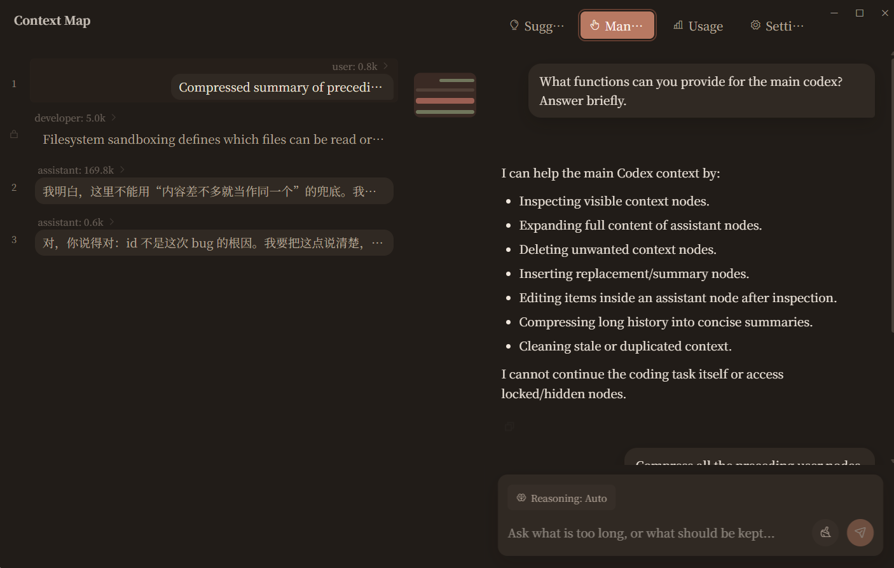
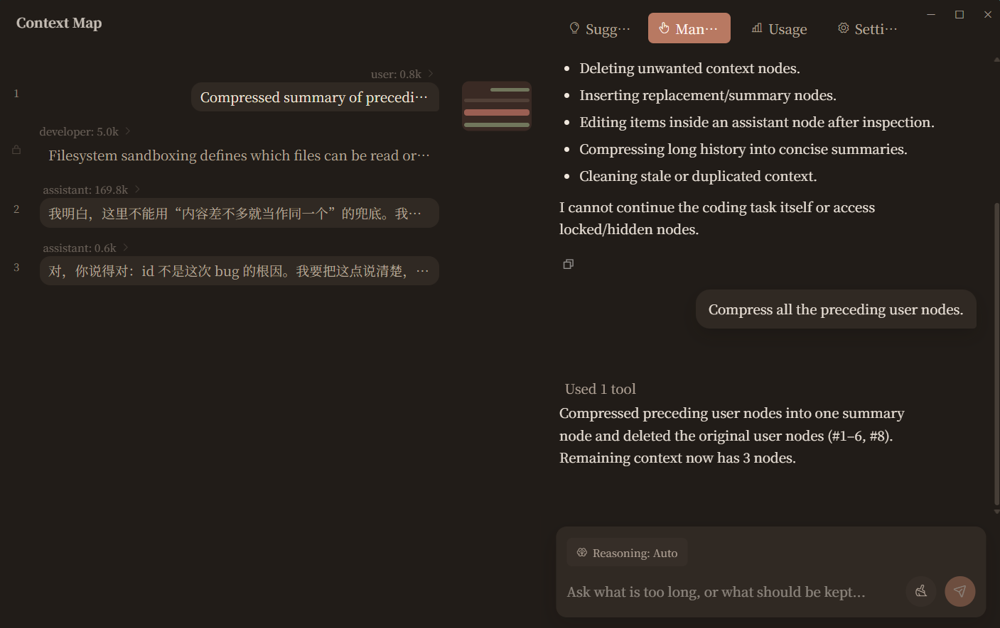
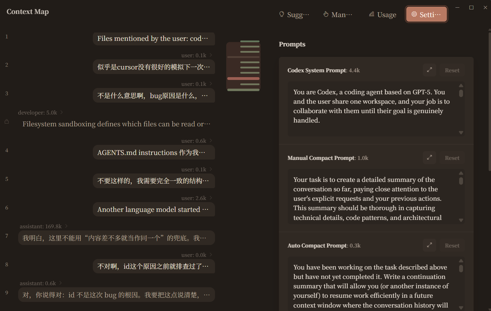
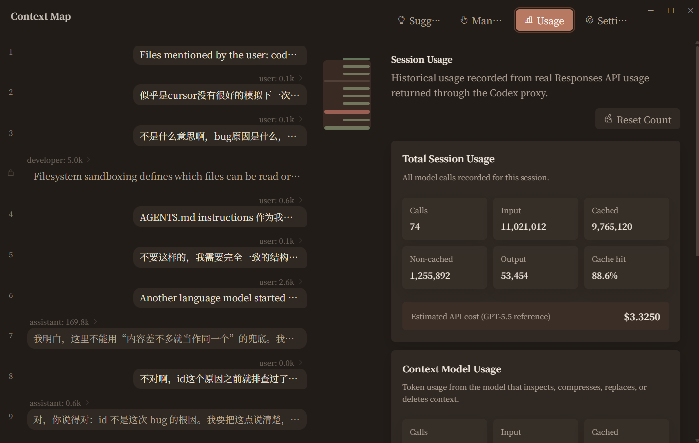
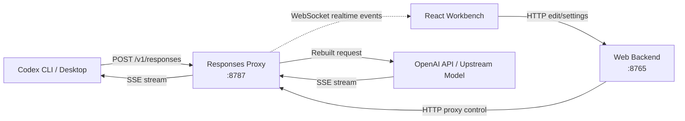
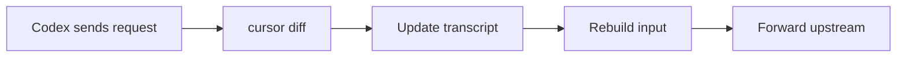

<p align="center">
  
</p>

<h1 align="center">Codex Context Studio</h1>

<p align="center">
  <strong>🧠 Context Control Panel for Codex</strong>
  <br>
  <sub>Make Codex's context visible, locatable, and precisely manageable — like memory.</sub>
</p>

<p align="center">
  <a href="#-core-features">Features</a> ·
  <a href="#-architecture">Architecture</a> ·
  <a href="#-quick-start">Install</a> ·
  <a href="#-faq">FAQ</a>
</p>

<p align="center">
  <a href="README.md">English</a> ·
  <a href="README.zh-CN.md">中文</a>
</p>

<p align="center">
  
  
  
  
  
  
</p>


---

## ⚡ In One Line

This project lets you see Codex's context consumption, what's retained after compression, and edit it yourself. It also lets you replace Codex's system prompt to break through Codex's limitations, and replace Codex's compression prompt for better compressed output.

---

## 🎯 Core Features

### 🔬 Context Visualization — See Inside Codex's Brain

> View Codex's context by role, check token usage per turn, and see when prompts are injected.

### ✂️ Context Management — Take Over Codex's Memory

> Chat with a dedicated secondary model to analyze, edit, compress, and manage the main Codex's context. You can plug in a cheap secondary model.

### 📈 Usage Panel — How Much Did This Session Cost?

> View token consumption, cache hit rate, and estimated cost across your Codex session.

### 🔀 Prompt Replacement — Rewrite Codex's Default Prompts

> Replace Codex's system prompt and native compression prompt for jailbreaking and better compression quality.

### 🔌 Local Proxy — Transparent, Non-Invasive

> No Codex source code changes, no official tools replaced. Sits in the middle as a local proxy, compatible with all native features.

---

## 📸 Screenshots

### Context Map & Secondary Model Chat



### Context Compression Result



### Prompt Replacement



### Usage Panel



---

## 🏗️ Architecture



**How It Works:**

Every Codex request follows the same path — there is no "pass-through if unedited" branch:



- **Transcript** is the single source of truth: what users see in the workbench, edit, and what ultimately gets sent upstream
- **Without edits**, the rebuilt input is naturally equivalent to the original Codex input
- **With edits**, upstream receives the edited transcript + new content from the current turn
- **During compression**, Codex's native compression prompt is replaced with a custom version, and the result is written back to the transcript

---

## 🚀 Quick Start

**1. Install**

Download and run the latest Windows installer from [Releases](https://github.com/nicobailon/codex-context-studio/releases).

**2. Enable CLI Proxy**

```powershell
codex ctx proxy on      # Enable proxy
codex                   # Use Codex normally
codex ctx proxy status  # Check status
codex ctx proxy off     # Disable proxy
```

**3. Desktop Support**

```powershell
codex ctx desktop on      # Enable Desktop mode
codex ctx desktop status  # Check status
codex ctx desktop off     # Disable
```

> [!NOTE]
> Desktop mode modifies local Codex provider configuration. CLI mode only adds a shim and does not affect any config files.

---

## 🛠️ Development

```powershell
# Install dependencies
npm install
npm run setup:python

# Run the full local flow
npm run codex

# Run only the context window
npm run window

# Run checks
npm run typecheck
npm test

# Build Windows installer
npm run dist:win
```

---

## ❓ FAQ

<details>
<summary><strong>Is this a Codex plugin?</strong></summary>

No. Codex Context Studio is a local context layer around Codex, implemented through proxy technology.

</details>

<details>
<summary><strong>Will it break the cache?</strong></summary>

Compression is not a frequent event. After compression, it only recalculates once, which is more cost-efficient than carrying useless context. In practice, cache hit rate only drops by 5–10%.

</details>

<details>
<summary><strong>Why not just rely on auto-compaction?</strong></summary>

Compatible with native compression. The project also helps replace compression prompts — we've built more precise, targeted compression features.

</details>

<details>
<summary><strong>Who is this for?</strong></summary>

People who want better control over context, have their own ideas about compression, or want to modify Codex's prompts.

</details>

---

<p align="center">
  <sub>GPL-3.0 · Made with ❤️ for Codex power users</sub>
</p>
