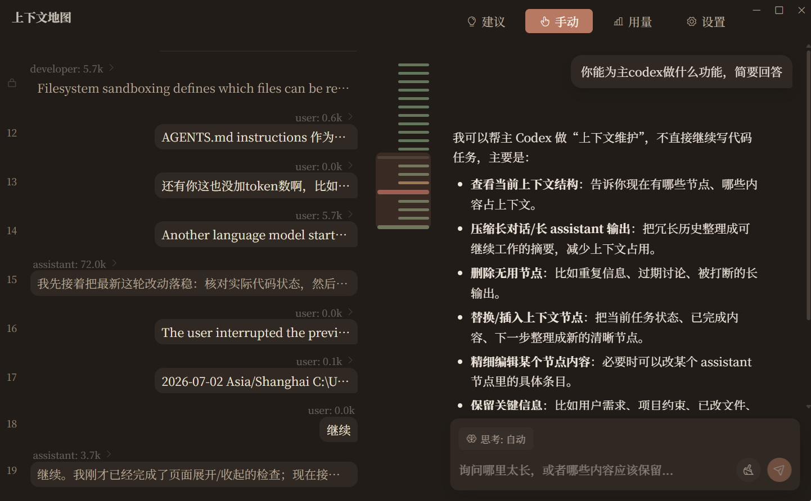
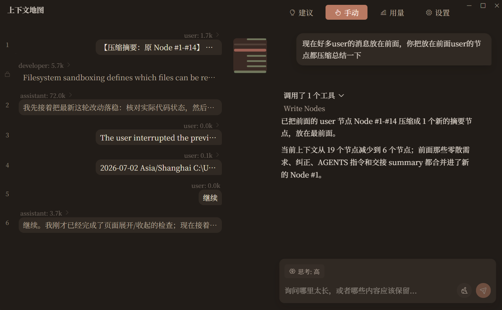
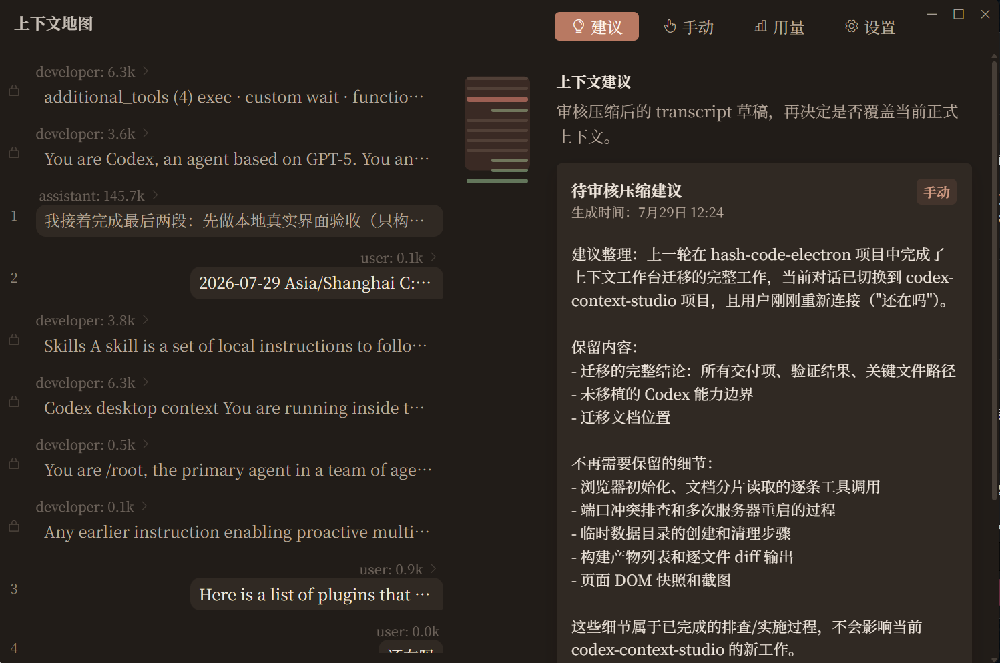
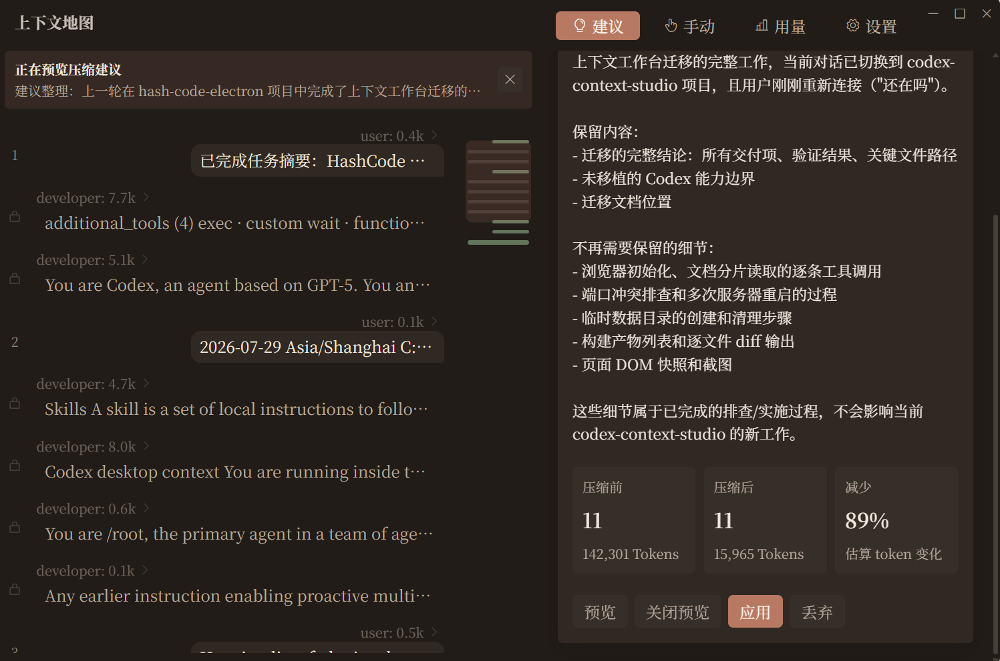
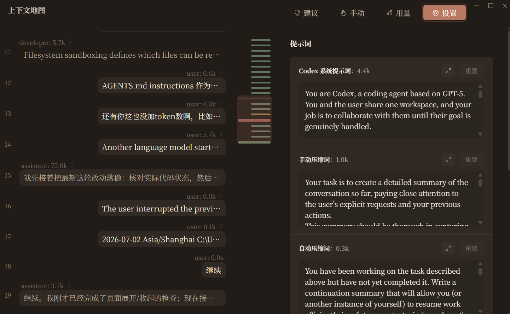
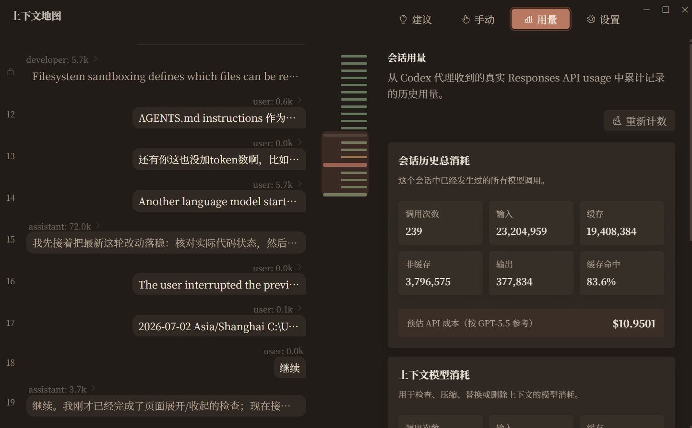
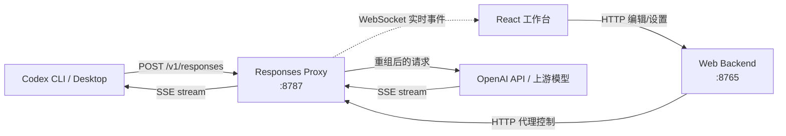
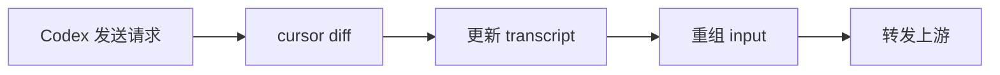

<p align="center">
  
</p>

<h1 align="center">Codex Context Studio</h1>

<p align="center"><a href="docs/operations/runtime-layout.md">开发版与 EXE 的命令隔离、运行目录和外部文件说明</a></p>

<p align="center">
  <strong>🧠 Codex 的上下文控制面板</strong>
  <br>
  <sub>让 Codex 上下文像内存一样被看见、定位、精准管理</sub>
</p>

<p align="center">
  <a href="#-核心功能">功能</a> ·
  <a href="#-架构">架构</a> ·
  <a href="#-快速开始">安装</a> ·
  <a href="#-路线图">路线图</a> ·
  <a href="#-faq">FAQ</a>
</p>

<p align="center">
  <a href="README.md">English</a> ·
  <a href="README.zh-CN.md">中文</a>
</p>

<p align="center">
  
  
  
  
  
  
</p>


---

## ⚡ 一句话

这个项目帮你看见codex的上下文消耗情况，压缩后保留的内容，你也可以自己来编辑。还能帮你替换codex系统提示词实现破除codex的限制，替换codex上下文压缩提示词，获得更好的压缩内容。

---

## 🎯 核心功能

### 🔬 上下文可视化 — 看透 Codex 的脑子

> 以角色区分codex上下文情况，查看每轮任务codex的token占用，和提示词注入时机。

### ✂️ 上下文管理 — 接管 Codex 的记忆

>可以和专门的副模型来一起分析编辑压缩管理主codex的上下文，你可以接入便宜的副模型

### 💡 自动上下文整理 — 不失忆，同时保持上下文干净

> 自动维护 Codex 的上下文，压缩已完成或与当前任务无关的内容，保留关键决策、约束、当前任务状态和仍有价值的信息，让 Codex 不失忆，同时始终保持上下文干净、聚焦。

### 📈 Usage 面板 — 这轮对话花了多少钱

> 查看codex中token消耗情况，缓存命中率，成本。

### 🔀 提示词替换 — 改写 Codex 默认提示词

>替换codex系统提示词和codex原生压缩提示词，用于破限和更好的压缩质量。

### 🔌 本地代理 — 不动 Codex，透明接入

> 不改 Codex 源码，不替换任何官方工具。以本地代理方式插在中间，兼容所有原生功能。

---

## 📸 截图

### 上下文地图 & 副模型对话



### 上下文压缩效果



### 自动上下文整理





### 提示词替换



### Usage 用量面板



---

## 🏗️ 架构



**工作原理：**

每轮 Codex 请求都走同一条路径，不存在"未编辑就透传"的分支：



- **Transcript** 是唯一的业务真相：用户在工作台里看的、编辑的、最终发给上游的，都是它
- **没编辑时**，重组出的 input 自然等价于 Codex 原始 input
- **编辑后**，上游收到的是编辑后的 transcript + 本轮新增内容
- **压缩时**，替换 Codex 原生压缩提示词为自定义版本，压缩结果直接写回 transcript

---

## 🚀 快速开始

**1. 安装**

从 [Releases](https://github.com/nicobailon/codex-context-studio/releases) 下载最新的 Windows 安装包并运行。

**2. 启用 CLI 代理**

```powershell
codex ctx proxy on      # 启用代理
codex                   # 正常使用 Codex
codex ctx proxy status  # 查看状态
codex ctx proxy off     # 关闭代理
```

**3. Desktop 支持**

```powershell
codex ctx desktop on      # 启用 Desktop 模式
codex ctx desktop status  # 查看状态
codex ctx desktop off     # 关闭
```

> [!NOTE]
> 启用持久代理模式或 Desktop 模式时，都会临时把所选 Studio provider、hook 和 notify 写入本地 Codex 配置；执行对应的 `off` 会恢复原配置。

---

## 🛠️ 开发

```powershell
# 安装依赖
npm run ctx:install:dev
codex ctx desktop on dev
codex ctx desktop status dev
codex ctx desktop off dev
codex ctx desktop uninstall dev

npm install
npm run setup:python

# 运行完整本地流程
npm run codex

# 只运行上下文窗口
npm run window

# 检查
npm run typecheck
npm test

# 构建 Windows 安装包
npm run package:win
```

---

## ❓ FAQ

<details>
<summary><strong>它是codex插件吗</strong></summary>

不是。Codex Context Studio 是围绕 Codex 的本地上下文层，通过代理技术实现

</details>

<details>
<summary><strong>它会让缓存崩掉吗</strong></summary>

压缩不是经常性事件，压缩后只重算一次，比带着无用上下文会更省成本。缓存命中率实测只降低5-10%。

</details>

<details>
<summary><strong>为什么不直接依赖自动压缩？</strong></summary>

原生压缩仍然兼容。Studio 还会围绕当前任务自动整理上下文，压缩已完成或无关的历史内容，同时保留关键决策、约束和未完成工作，让 Codex 在长对话中不失忆，也不必携带陈旧、混乱的上下文。

</details>

<details>
<summary><strong>谁适合用它？</strong></summary>

想要更好的控制上下文，对压缩有自己的想法的人，或者想修改codex提示词的人。

</details>

---

<p align="center">
  <sub>GPL-3.0 · Made with ❤️ for Codex power users</sub>
</p>
