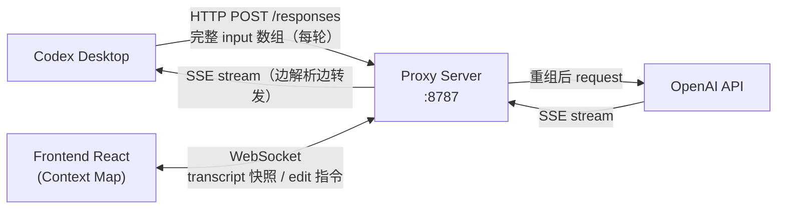
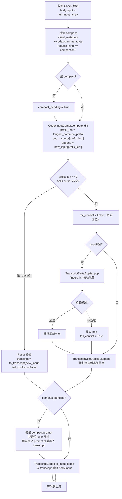
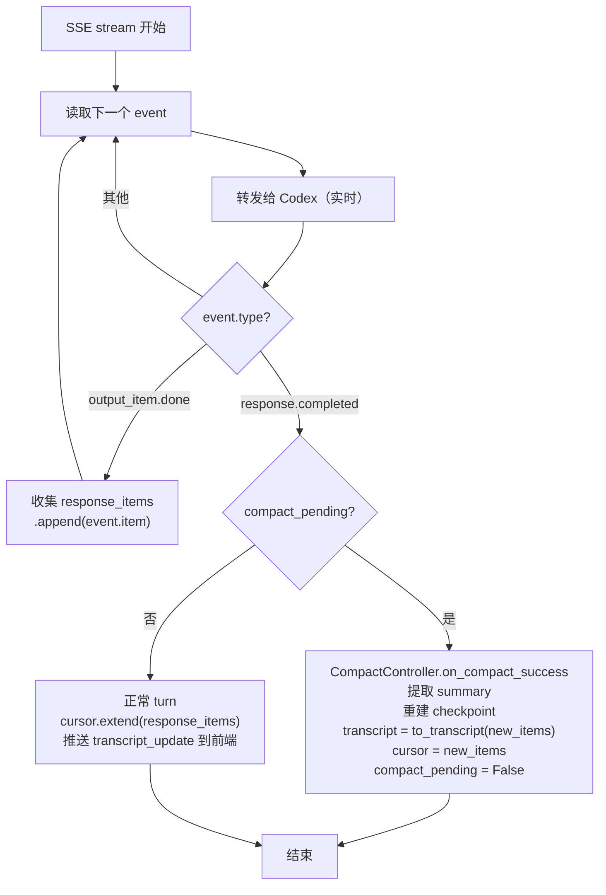
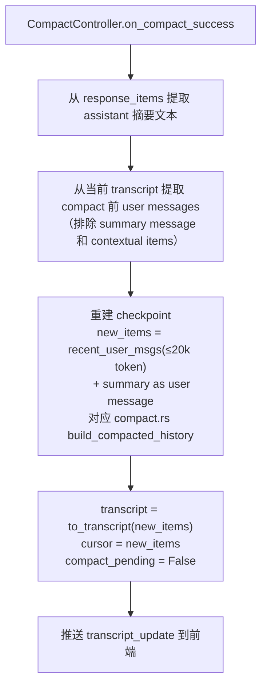
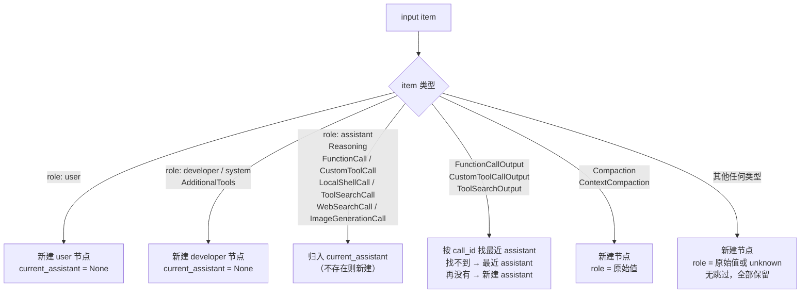
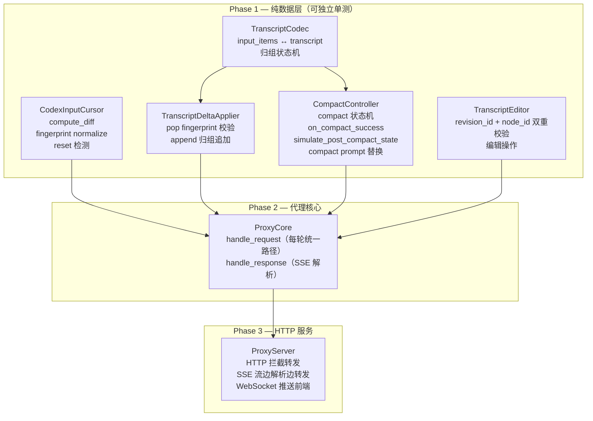
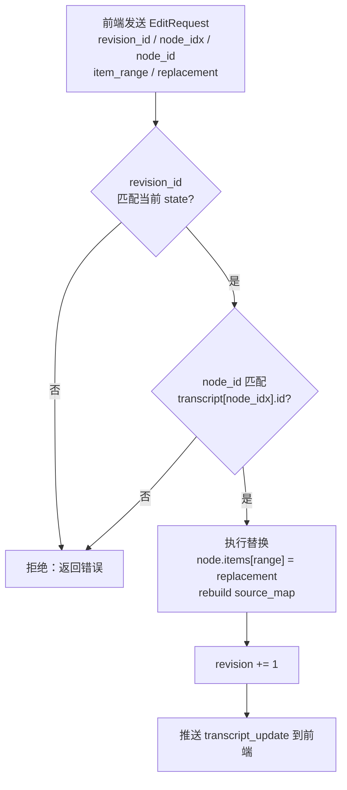

# Hash Context Proxy — Architecture

## 整体数据流

```mermaid
flowchart LR
    CD["Codex Desktop"]
    PX["Proxy Server\n:8787"]
    OAI["OpenAI API"]
    FE["Frontend React\n(Context Map)"]

    CD -- "HTTP POST /responses\n完整 input 数组（每轮）" --> PX
    PX -- "重组后 request" --> OAI
    OAI -- "SSE stream" --> PX
    PX -- "SSE stream（边解析边转发）" --> CD
    FE <-- "WebSocket\ntranscript 快照 / edit 指令" --> PX
```

---

## 每轮请求处理

```mermaid
flowchart TD
    A["收到 Codex 请求\nbody.input = full_input_array"]
    B["检测 compact\nclient_metadata\nx-codex-turn-metadata\nrequest_kind == compaction?"]
    C{"是 compact?"}
    CP["compact_pending = True"]

    D["CodexInputCursor.compute_diff\nprefix_len = longest_common_prefix\npop  = cursor[prefix_len:]\nappend = new_input[prefix_len:]"]
    E{"prefix_len == 0\nAND cursor 非空?"}
    RST["Reset 路径\ntranscript = to_transcript(new_input)\ntail_conflict = False"]

    F["tail_conflict = False（每轮复位）"]
    G{"pop 非空?"}
    H["TranscriptDeltaApplier.pop\nfingerprint 校验尾部"]
    I{"校验通过?"}
    J["移除尾部节点"]
    K["跳过 pop\ntail_conflict = True"]
    L["TranscriptDeltaApplier.append\n按归组规则追加节点"]

    M{"compact_pending?"}
    N["替换 compact prompt\n找最后 user 节点\n用自定义 prompt 覆盖写入 transcript"]

    O["TranscriptCodec.to_input_items\n从 transcript 重组 body.input"]
    P["转发到上游"]

    A --> B --> C
    C -- 是 --> CP --> D
    C -- 否 --> D
    D --> E
    E -- 是（reset）--> RST --> M
    E -- 否 --> F --> G
    G -- 是 --> H --> I
    I -- 通过 --> J --> L
    I -- 不通过 --> K --> L
    G -- 否 --> L
    L --> M
    M -- 是 --> N --> O --> P
    M -- 否 --> O --> P
```

---

## 响应处理（SSE 流）

```mermaid
flowchart TD
    S["SSE stream 开始"]
    LOOP["读取下一个 event"]
    FWD["转发给 Codex（实时）"]
    T{"event.type?"}
    COL["收集 response_items\n.append(event.item)"]
    DONE{"compact_pending?"}
    CS["CompactController.on_compact_success\n提取 summary\n重建 checkpoint\ntranscript = to_transcript(new_items)\ncursor = new_items\ncompact_pending = False"]
    CA["正常 turn\ncursor.extend(response_items)\n推送 transcript_update 到前端"]
    END["结束"]

    S --> LOOP --> FWD --> T
    T -- "output_item.done" --> COL --> LOOP
    T -- "其他" --> LOOP
    T -- "response.completed" --> DONE
    DONE -- 是 --> CS --> END
    DONE -- 否 --> CA --> END
```

---

## Compact 成功后状态重建

```mermaid
flowchart TD
    SUC["CompactController.on_compact_success"]
    EXT["从 response_items 提取 assistant 摘要文本"]
    USR["从当前 transcript 提取 compact 前 user messages\n（排除 summary message 和 contextual items）"]
    BLD["重建 checkpoint\nnew_items = recent_user_msgs(≤20k token)\n        + summary as user message\n对应 compact.rs build_compacted_history"]
    UPD["transcript = to_transcript(new_items)\ncursor = new_items\ncompact_pending = False"]
    PUSH["推送 transcript_update 到前端"]

    SUC --> EXT --> USR --> BLD --> UPD --> PUSH
```

---

## 归组规则

```mermaid
flowchart TD
    ITEM["input item"]
    R{"item 类型"}

    USR["新建 user 节点\ncurrent_assistant = None"]
    DEV["新建 developer 节点\ncurrent_assistant = None"]
    ASS["归入 current_assistant\n（不存在则新建）"]
    TOUT["按 call_id 找最近 assistant\n找不到 → 最近 assistant\n再没有 → 新建 assistant"]
    CMP["新建节点\nrole = 原始值"]
    OTHER["新建节点\nrole = 原始值或 unknown\n无跳过，全部保留"]

    ITEM --> R
    R -- "role: user" --> USR
    R -- "role: developer / system\nAdditionalTools" --> DEV
    R -- "role: assistant\nReasoning\nFunctionCall / CustomToolCall\nLocalShellCall / ToolSearchCall\nWebSearchCall / ImageGenerationCall" --> ASS
    R -- "FunctionCallOutput\nCustomToolCallOutput\nToolSearchOutput" --> TOUT
    R -- "Compaction\nContextCompaction" --> CMP
    R -- "其他任何类型" --> OTHER
```

---

## 模块职责

```mermaid
flowchart TB
    subgraph PH1["Phase 1 — 纯数据层（可独立单测）"]
        TC["TranscriptCodec\ninput_items ↔ transcript\n归组状态机"]
        CI["CodexInputCursor\ncompute_diff\nfingerprint normalize\nreset 检测"]
        DA["TranscriptDeltaApplier\npop fingerprint 校验\nappend 归组追加"]
        CO["CompactController\ncompact 状态机\non_compact_success\nsimulate_post_compact_state\ncompact prompt 替换"]
        TE["TranscriptEditor\nrevision_id + node_id 双重校验\n编辑操作"]
    end

    subgraph PH2["Phase 2 — 代理核心"]
        PC["ProxyCore\nhandle_request（每轮统一路径）\nhandle_response（SSE 解析）"]
    end

    subgraph PH3["Phase 3 — HTTP 服务"]
        PS["ProxyServer\nHTTP 拦截转发\nSSE 流边解析边转发\nWebSocket 推送前端"]
    end

    TC --> DA
    TC --> CO
    CI --> PC
    DA --> PC
    CO --> PC
    TE --> PC
    PC --> PS
```

---

## 编辑流程

```mermaid
flowchart TD
    ED["前端发送 EditRequest\nrevision_id / node_idx / node_id\nitem_range / replacement"]
    V1{"revision_id\n匹配当前 state?"}
    V2{"node_id 匹配\ntranscript[node_idx].id?"}
    REJ["拒绝：返回错误"]
    APPLY["执行替换\nnode.items[range] = replacement\nrebuild source_map"]
    REV["revision += 1"]
    PUSH["推送 transcript_update 到前端"]

    ED --> V1
    V1 -- 否 --> REJ
    V1 -- 是 --> V2
    V2 -- 否 --> REJ
    V2 -- 是 --> APPLY --> REV --> PUSH
```
