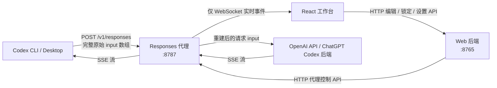
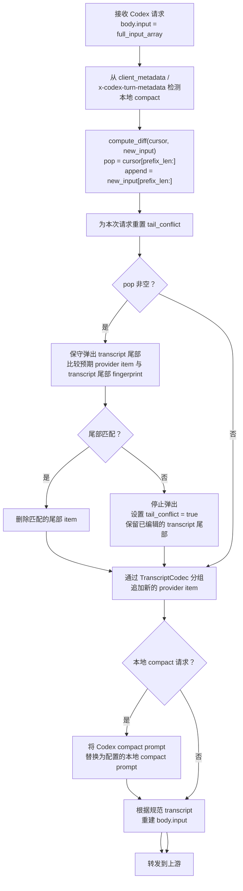
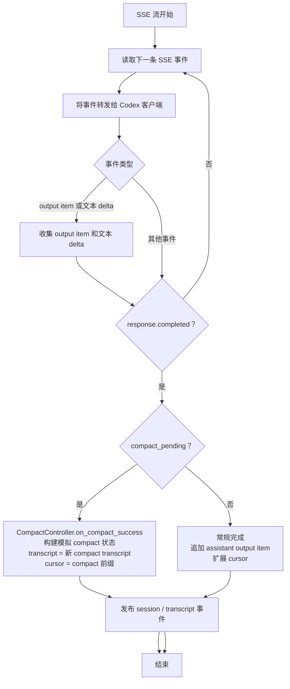
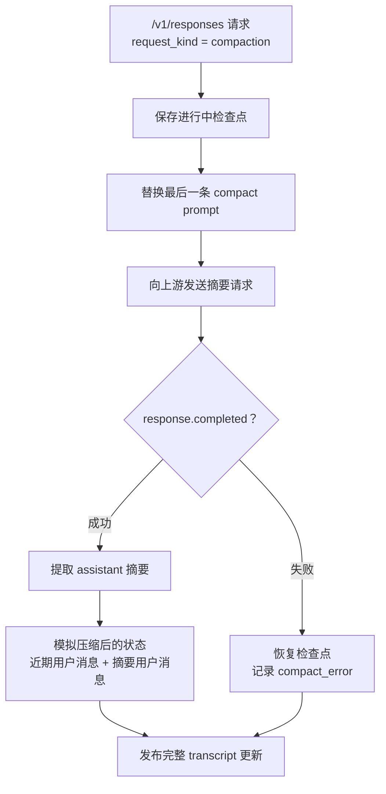
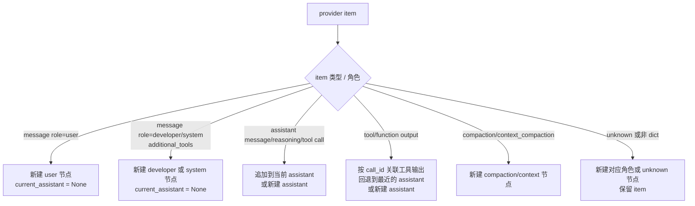
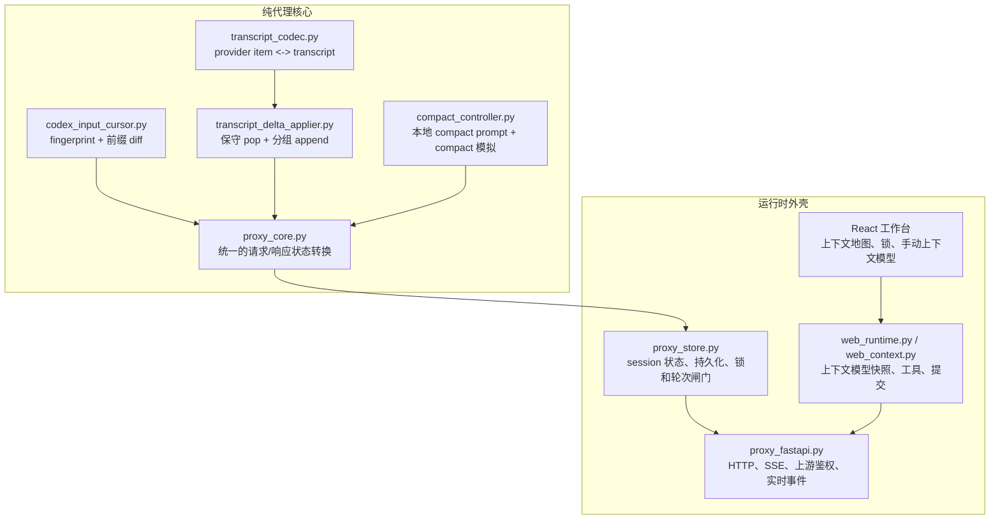
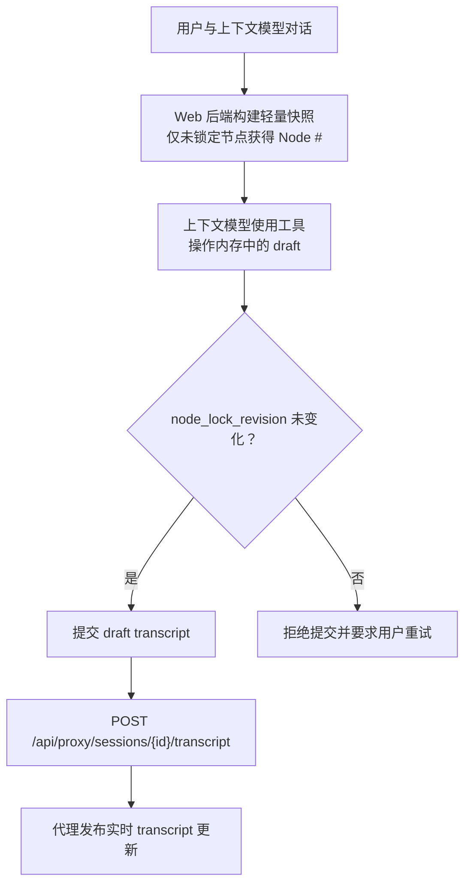

# Codex Context Studio - 架构

## 整体流程

代理 WebSocket 只支持实时订阅（`ping` 和 `subscribe`）。Transcript 替换、节点锁定、context-run 状态和 main-turn 状态均使用 HTTP API。

---

## 请求处理

当 `prefix_len == 0` 时不存在重置分支。如果旧 cursor 尾部无法与 transcript 尾部安全匹配，代理会保留本地 transcript 尾部，并追加新的原始 input 后缀。

---

## 响应处理

代理会跨 chunk 边界解析 SSE。响应 item 在追加到 cursor 前，会先投影成 request-item 结构。

---

## 本地 Compact

`POST /v1/responses/compact` 上的远程 compact 已禁用。唯一支持的 compact 路径，是 `/v1/responses` 上的本地 compact metadata。

---

## Transcript 分组

不会因为不认识某个 provider item 就跳过它。未知 item 和非 dict item 都会保留，以便 transcript 无损重建 provider input。

---

## 模块职责

---

## 工作台提交流程

Draft 是临时对象，只属于上下文模型的单个轮次。提交后的对象仍是规范的代理 transcript；不存在第二份持久 transcript 或 override 层。
