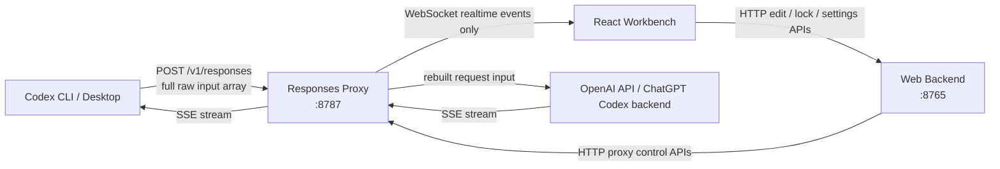
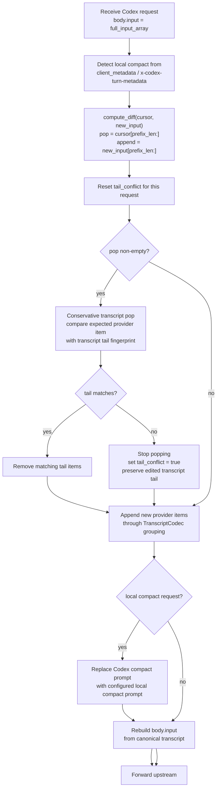
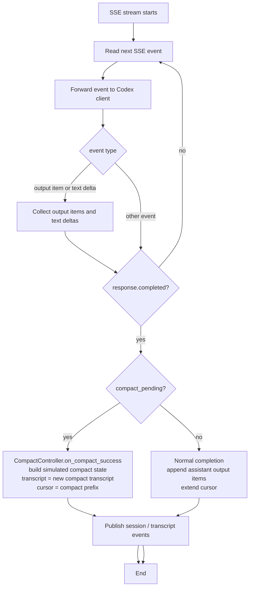
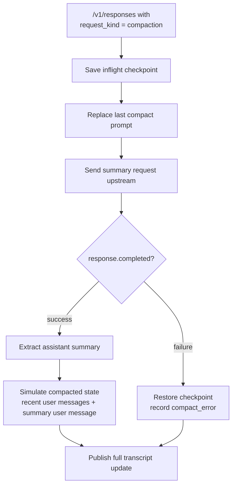
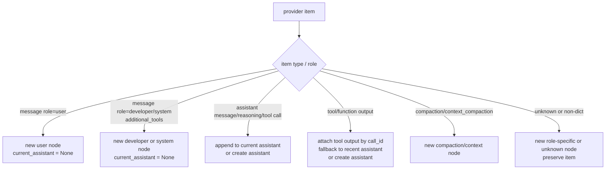
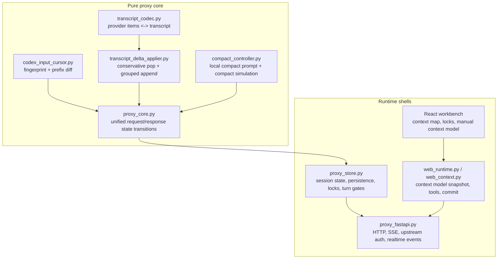
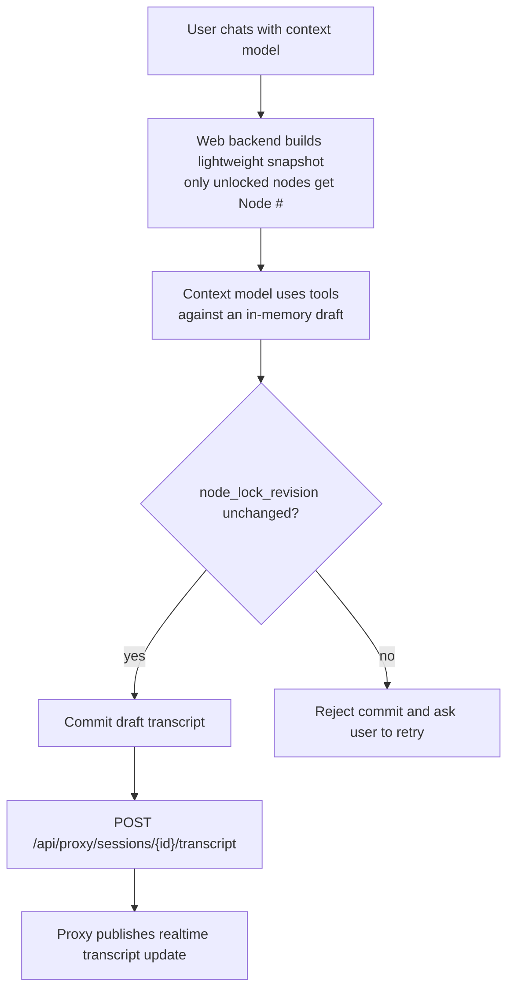

# Hash Context Proxy - Architecture

## Overall Flow

The proxy WebSocket only supports realtime subscriptions (`ping` and
`subscribe`). Transcript replacement, node locking, context-run state, and
main-turn state all use HTTP APIs.

---

## Request Handling

There is no reset branch when `prefix_len == 0`. If the old cursor tail cannot
be safely matched against the transcript tail, the proxy preserves the local
transcript tail and appends the new raw input suffix.

---

## Response Handling

The proxy parses SSE across chunk boundaries. Response items are projected into
request-item shape before they are appended to the cursor.

---

## Local Compact

Remote compact is disabled at `POST /v1/responses/compact`. The only supported
compact path is local compact metadata on `/v1/responses`.

---

## Transcript Grouping

No provider item is skipped because it is unfamiliar. Unknown and non-dict items
are preserved so transcript can rebuild provider input losslessly.

---

## Module Responsibilities

---

## Workbench Commit Flow

The draft is temporary and belongs to one context-model turn. The committed
object is still the canonical proxy transcript; there is no second persistent
transcript or override layer.
