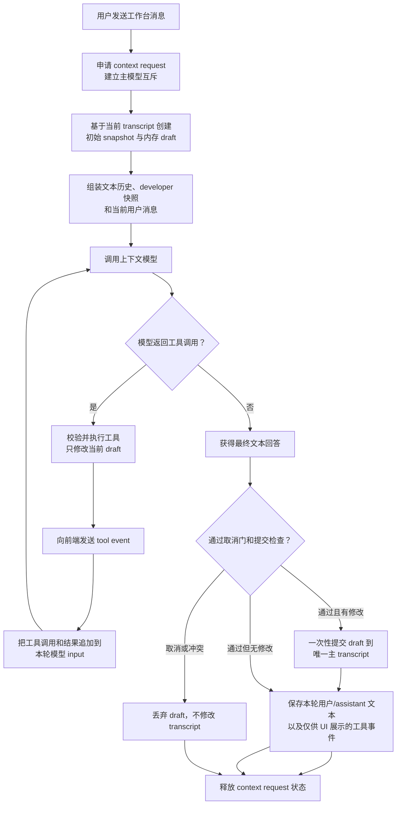

# 上下文模型与工具循环设计

## 1. 文档定位

本文描述上下文工作台中“上下文模型”的完整模块设计，包括它与主 Codex 的关系、输入上下文、节点工具、单轮工具循环、草稿提交、对话历史、并发互斥与异常处理。

设计意图来自重构前的 `docs/user-intent.md`，本文已按照当前项目的数据模型和实现修订。后续开发以本文、[代理核心设计](../../architecture/proxy-core.md)和[产品原则](../../product/principles.md)为准，不再从旧文档恢复 `override`、`restore` 或多份 transcript 逻辑。

## 2. 模块定位

上下文模型是一个独立的维护 agent。它和用户讨论主 Codex 当前携带的上下文，并在用户明确要求时，通过受控工具整理主 transcript。

它解决的是“AI 如何维护另一个 AI 的工作记忆”，而不是继续主 Codex 的编程任务。

它应该能够：

- 解释当前上下文由哪些节点组成，哪些内容占用较多上下文。
- 找出重复、过期、已完成或会干扰后续工作的内容。
- 保留真实目标、约束、决策、已验证事实、当前进展和未解决问题。
- 按用户意图删除、合并、压缩、替换或补充节点。
- 在修改前按需读取细节，在修改后清楚说明改了什么、保留了什么。

它不负责：

- 接管或继续主 Codex 正在执行的任务。
- 修改用于协议对齐的 `codex_input_cursor`。
- 创建第二份长期存在的 transcript。
- 自动把所有历史压成一段摘要。
- 为了减少 token 而牺牲任务准确性和连续性。
- 恢复已经移除的 `override`、`edited_transcript`、`restore` 等旧状态模型。

上下文模型可以和主 Codex 使用同一个上游，也可以配置为其他 provider 或模型。模型接入方式可以变化，但快照、工具和提交语义必须保持一致。

## 3. 核心心智模型

理解这个模块时，需要严格区分下面四类对象：

| 对象 | 生命周期 | 作用 | 能否被上下文模型修改 |
| --- | --- | --- | --- |
| 主 `transcript` | 按会话持久化 | 主 Codex 上游 `input` 的唯一业务真相 | 可以，但只能通过工具循环最终提交 |
| `codex_input_cursor` | 按会话持久化 | 记录上一轮 Codex input，用于计算下一轮的 pop/append 差异 | 不可以 |
| Workbench 对话历史 | 按会话持久化 | 保存用户与上下文模型之间的文本对话，供后续交流连续使用 | 由工作台单独维护，不属于主 transcript |
| 单轮 `draft` | 仅当前工具循环内存中存在 | 承接这一轮尚未提交的节点修改 | 工具直接操作，循环完成后一次性提交或整体丢弃 |

这四类对象不能混用：

- `transcript` 是主上下文本身。
- cursor 只是与 Codex 协议对齐的机器锚点，不是另一份上下文。
- Workbench 历史是“用户和上下文管家的对话”，不会写进主 Codex transcript。
- draft 是事务内的临时工作区，不是可以恢复、切换或长期保存的上下文版本。

### 3.1 不可破坏的设计约束

1. 任意时刻只有一份持久化主 transcript。
2. 工具调用只修改当前轮 draft，不直接逐步写入主 transcript。
3. 模型每次写操作后都能看到更新结果，因此模型视角接近实时编辑。
4. 用户取消、提交冲突或提交前失败时，draft 不能污染主 transcript。
5. Workbench commit 不修改 cursor。
6. 锁定节点对上下文模型不可见、不可读、不可编辑，但最终提交时必须原样保留。
7. Node # 是一次工具循环内的临时地址，不是节点的永久身份。

## 4. 一轮上下文模型请求的输入

每次用户在工作台发送消息，后端都会重新组装一次上下文模型输入。输入由四部分组成：

1. 固定的上下文管家职责和安全规则。
2. 最近的 Workbench 用户/assistant 文本历史。
3. 本轮新生成的 developer 快照。
4. 用户当前消息。

```text
上下文管家 instructions
        +
最近的 Workbench 文本历史
        +
developer：当前主 Codex 上下文快照
        +
user：本轮要求
```

developer 快照是本轮判断节点位置和内容的唯一事实来源。历史消息中提到的节点编号、内容或状态可能已经过期，不能覆盖新快照。

### 4.1 轻量快照

上下文模型面对的业务对象是完整 transcript，但这不意味着每轮都把全部 provider item 塞进模型。

当前快照包含：

- 会话标题。
- 当前可编辑节点数。
- 当前选中节点。
- 节点的临时 Node #。
- 节点角色、token 估算和必要统计。
- assistant 节点的首句预览、item 数量和工具使用概览。
- 非 assistant 节点的完整文本。

assistant 节点可能包含 reasoning、工具调用、工具输出和多种结构化 item，体积通常更大，所以默认只给预览。模型在压缩或细粒度编辑 assistant 节点前，必须先调用 `get_nodes` 获取完整结构，不能根据首句预览编造摘要。

已锁定节点不会出现在快照中，也不会占用可编辑 Node #。`developer` 节点默认锁定；用户明确解锁后，它才会像普通节点一样进入快照。

### 4.2 为什么不直接发送完整 transcript

轻量快照有四个目的：

- 降低每轮固定输入成本。
- 避免大量工具输出长期挤占上下文模型自己的对话窗口。
- 迫使模型在真正需要时才读取细节，减少无意义分析。
- 让模型优先在节点层思考，而不是一开始就陷入 item/event 细节。

`get_nodes` 的重复只读调用会在当前轮内去重。发生写操作后，旧的读取缓存失效，因为节点内容可能已经变化。

## 5. Node # 与寻址规则

Node # 是工具循环开始时，根据“当前未锁定节点集合”生成的 1-based 编号。

它有以下规则：

- 编号只在当前轮有效，下一轮会基于最新 transcript 重新生成。
- 编号只覆盖未锁定节点；锁定节点不会形成编号空洞。
- 当前选中节点和工具使用同一套编号。
- `write_nodes` 中的删除目标与插入锚点，始终引用本轮初始快照。
- 即使某个锚点同时被删除，仍可以用它的初始 Node # 指定插入位置。
- `after: 0` 表示插入到所有可见节点之前。
- 新插入的 draft 节点没有初始 Node #，不能把它当成新的稳定工具地址。

写工具返回的 updated snapshot 是“修改结果视图”，用于让模型确认当前 draft；它不会开启一套新的寻址空间。后续工具调用仍应以本轮初始快照编号为准。因此，一组可以一次描述清楚的节点修改，应该尽量在一次 `write_nodes` 中完成。

## 6. 工具设计

### 6.1 `get_nodes`：按需展开节点

用途：读取一个或多个节点的完整结构化内容。

```json
{
  "node_numbers": [1, 2, 6]
}
```

返回内容包括节点角色、完整 provider items、文本块、工具块、附件信息和当前 draft 状态。它是只读工具，不产生修改。

使用原则：

- assistant 节点在压缩前必须先读。
- 非 assistant 节点已在初始快照中给出全文，通常不需要重复读取。
- 不要重复读取同一批未变化节点。
- 需要 item 级编辑时，先通过这里获得可靠的 item #。

### 6.2 `write_nodes`：主编辑工具

用途：在一次调用中完成节点级删除和插入。节点替换、范围压缩和多节点合并，本质上都表达为“删除旧节点 + 在指定锚点插入新节点”。

```json
{
  "delete": [5, 6, 7, 10],
  "inserts": [
    {
      "after": 4,
      "role": "user",
      "content": "压缩后的阶段总结"
    }
  ]
}
```

它支持：

- 删除一个节点。
- 删除连续或不连续的多个节点。
- 纯删除，不插入任何内容。
- 在任意初始节点后插入新节点。
- 在最前方插入新节点。
- 用一个摘要替换一段节点。
- 把多个不连续片段整理为一个或多个新节点。

每个插入项独立指定：

- `after`：初始快照中的锚点 Node #，`0` 表示最前。
- `role`：`user`、`assistant` 或 `developer`，默认按 `user` 处理。
- `content`：新节点的 Markdown 文本。

工具执行后返回：

- 实际删除的初始 Node #。
- 创建的新节点数量。
- 当前 draft 的 updated snapshot。

模型应根据 updated snapshot 检查结果，再向用户说明影响。

### 6.3 `write_items`：受限的细粒度编辑

用途：在一个节点内部删除或插入 provider item。

```json
{
  "node_number": 6,
  "delete": [2, 3],
  "inserts": [
    {
      "after": 1,
      "content": "替换内容"
    }
  ]
}
```

设计边界：

- 必须先用 `get_nodes` 看清该节点的完整 item 列表。
- item # 是 1-based，并以读取到的当前节点内容为准。
- `after: 0` 表示插到该节点所有 item 之前。
- 主要用于 assistant 节点内部确实需要保留部分工具链、删除部分条目的情况。
- 能用节点级整理完成时，不使用 item 级编辑。

item 级编辑保留了精细控制能力，但不是上下文模型的主流程。过度依赖它会增加调用次数、决策复杂度和误删风险。

## 7. 两层循环设计

上下文模型存在两个不同尺度的循环，不能混为一谈。

### 7.1 外层：Workbench 对话轮次

用户发送一条消息到上下文模型，构成一个新的 Workbench 对话轮次。每个新轮次都会：

1. 从当前主 transcript 创建新的轻量快照和 draft。
2. 重新生成 developer 消息。
3. 只带入最近的用户/assistant 文本历史。
4. 丢弃上一轮模型输入里的 function call、tool result 和 developer 快照。

这保证长期对话保持轻量，也避免模型拿旧工具结果当作当前事实。

### 7.2 内层：单轮工具循环

在一次 Workbench 对话轮次内部，模型可以经历多次“推理 → 调工具 → 查看结果 → 继续推理”。



同一内层循环中，模型输入会累计当前轮的 function call 和 tool result。这样模型能连续理解自己刚才做了什么，也能提高相同前缀的缓存利用率。

模型一旦返回最终文本且不再调用工具，内层循环结束。工具循环没有把中间过程直接写入主 transcript；只有最终提交阶段会改变真实上下文。

## 8. Draft 与“实时修改”语义

实现使用内存 draft，但模型感知到的是连续更新的工作区：

1. 初始 draft 从本轮开始时的主 transcript 创建。
2. `get_nodes` 从当前 draft 读取。
3. `write_nodes` 或 `write_items` 修改当前 draft。
4. 写工具返回修改结果，`write_nodes` 还返回 updated snapshot。
5. 模型基于新结果继续推理。
6. 循环结束后，draft 才统一提交。

因此，“工具后实时看到变化”和“最后一次性 commit”并不冲突：前者是模型视角，后者是持久化边界。

draft 内部还必须保留锁定节点。锁定节点只是从模型可见集合中移除，并不是从 transcript 副本中删除。最终生成提交结果时，未被编辑的锁定节点会按原顺序带回。

## 9. Commit 语义

### 9.1 提交前检查

最终提交需要经过两道门：

1. **取消门**：确认本轮 request 仍然有效，且用户没有在 commit 开始前取消。
2. **锁版本检查**：确认当前 `node_lock_revision` 与 draft 创建时一致。

第二道检查是防御性保证。正常情况下，上下文模型运行期间就不允许切换节点锁；即使未来出现并发入口，过期 draft 也不能覆盖新的锁状态。

### 9.2 提交内容

有修改时，提交阶段会：

1. 从所有 active draft 节点重建规范 transcript。
2. 保留未编辑节点及锁定节点的 provider item 顺序。
3. 尽可能保留既有节点身份，避免节点锁无故丢失。
4. 重新整理 input index。
5. 一次性替换当前会话的主 transcript 并持久化。
6. 若代理侧已经存在对应会话，同步新的 transcript 到代理状态。
7. 保存本轮 Workbench 用户/assistant 文本和供 UI 展示的工具事件。

代理同步不是第二份业务 transcript。Web 侧提交仍以唯一规范 transcript 为结果；如果后续代理同步失败，系统保留本地提交并在回答中附加同步警告，而不是静默伪装成全部成功。

### 9.3 Cursor 为什么不随 commit 修改

Workbench 改的是用户希望主 Codex 下一轮携带的 transcript，cursor 仍代表最近一次真实收到的 Codex input。下一轮 Codex 请求到达时，代理会继续通过 cursor 计算新 input 的 pop/append，再把差异应用到已经编辑过的 transcript。

如果 Workbench 为了“看起来同步”而同时改 cursor，cursor 就会从协议锚点变成第二份可编辑上下文，破坏唯一真相模型。

## 10. 并发、取消和失败处理

### 10.1 与主 Codex 互斥

同一会话中，主 Codex turn 和上下文模型不能同时修改上下文：

- 主 Codex 正在运行时，不能启动上下文模型。
- 上下文模型运行时，Web 后端拒绝启动第二个上下文请求。
- 上下文模型运行期间，代理收到普通主 Codex 请求会等待 context request 结束。
- 上下文模型使用的内部上游请求有独立标记，不会被自己的互斥规则阻塞。
- 上下文模型运行时不能切换节点锁。

互斥的目标不是限制并行计算本身，而是确保主 transcript 只有一个有效写入者。

### 10.2 用户取消

取消必须作用到服务端正在运行的 request，而不是只让前端停止读取：

1. 前端携带本轮 `request_id` 发起取消。
2. 服务端登记取消状态，并调用 provider 流的关闭回调。
3. 工具循环在模型调用前后、工具执行前后和提交前检查取消。
4. 如果取消先于 commit 门生效，整份 draft 丢弃。
5. transcript 和 Workbench 历史都不写入本轮结果。
6. context-run 状态释放后，才确认本轮真正结束。

commit 一旦开始，取消不能再对用户报告成“已成功撤销”，否则用户会误以为修改没有落盘。

### 10.3 工具错误

参数错误、节点不存在或工具执行失败会作为结构化 tool result 返回给模型。模型可以修正参数后继续当前轮，不需要为普通工具错误重建整个上下文模型请求。

只读 `get_nodes` 重复调用会被跳过；任意写操作后读取缓存清空，保证后续读取能看到新 draft。

### 10.4 Provider 或最终回答失败

- draft 尚未产生修改时，模型请求失败不会提交 transcript。
- draft 已有成功工具修改、但后续模型调用失败或最终文本为空时，运行时可以生成兜底说明，并提交已经成功形成的 draft。
- 用户取消是例外：取消必须阻止 draft 进入提交阶段。
- 锁版本冲突也是例外：即使工具已经修改 draft，也必须拒绝过期提交并要求重试。

## 11. Workbench 历史为什么要轻

系统会持久化 Workbench 对话，方便用户继续询问上下文管理问题；但“UI 需要展示”与“模型下一轮需要重放”是两件事。

当前边界是：

- UI 历史可以保存工具事件，用于解释这一轮做了什么。
- 下一轮发给模型时，只提取最近的 user/assistant 文本消息。
- 当前最多带入最近 12 条文本消息。
- developer 快照每轮重新生成，不从历史恢复。
- 上一轮 function call、tool result 和旧快照不会长期进入模型输入。
- 当前轮的工具调用和结果会一直保留到该轮工具循环结束。

这个设计同时保证了对话连续性、当前事实正确性和输入成本可控。

## 12. 手动上下文模型与自动建议的边界

手动上下文模型由用户发起，可以先讨论、再按明确要求修改，并在本轮结束时直接提交 draft。

自动上下文建议使用相同的 transcript 和节点编辑基础能力，但产品语义不同：

- 它生成的是待审查提案，不直接修改 live transcript。
- 没有明显收益时应该不生成提案。
- 有建议时只做一次完整的 `write_nodes` 规划。
- 用户预览并明确应用后，提案才进入主 transcript。

自动建议的调度、失效和审核流程见[上下文智能建议](../context-suggestions/design.md)。不要把自动建议的 pending review 状态引入手动工具循环。

## 13. 典型操作示例

### 13.1 压缩连续阶段

目标：把 Node #5 至 #7 的已完成讨论压成一个阶段总结。

1. 如果其中有 assistant 节点，先 `get_nodes(node_numbers=[5,6,7])`。
2. 确认目标、决策、结果和未完成事项。
3. 一次调用：

```json
{
  "delete": [5, 6, 7],
  "inserts": [
    {
      "after": 4,
      "role": "user",
      "content": "## 已完成阶段\n\n- 目标：……\n- 已确认决策：……\n- 验证结果：……\n- 后续仍需：……"
    }
  ]
}
```

这里使用 `after: 4`，因为替换内容需要占据原 #5 至 #7 所在的位置。

### 13.2 删除不连续污染节点

目标：删除 #5 至 #7、#8、#10 至 #13，不生成摘要。

```json
{
  "delete": [5, 6, 7, 8, 10, 11, 12, 13],
  "inserts": []
}
```

删除范围在工具协议中展开成明确 Node #，避免字符串范围解析产生歧义。

### 13.3 在最前方补充长期约束

```json
{
  "delete": [],
  "inserts": [
    {
      "after": 0,
      "role": "user",
      "content": "长期约束：所有上下文编辑必须保留用户已确认的产品决策。"
    }
  ]
}
```

### 13.4 只修改 assistant 节点内部条目

目标：保留 assistant 节点的结论，但删除其中一段已失效的工具输出。

1. `get_nodes(node_numbers=[6])` 获取完整 item 列表。
2. 确认目标 item 与关联的工具调用/输出关系。
3. 调用 `write_items` 删除对应 item；如需替换，在原始锚点后插入文本。
4. 如果关联关系复杂或证据不足，放弃 item 级编辑，改用更安全的节点级整理或向用户确认。

## 14. 当前实现映射

下面列出关键模块，便于排查问题时从职责入手，而不是在不同文件里重复补状态：

| 职责 | 当前实现 |
| --- | --- |
| 生成初始轻量快照 | `backend/web_context.py` 的 `build_context_workspace_snapshot` |
| 管理单轮内存草稿 | `ContextWorkbenchDraft` |
| 定义和执行三个工作台工具 | `ContextWorkbenchToolRegistry` |
| 组装本轮历史、developer 快照和用户消息 | `backend/web_runtime.py` 的 `build_context_chat_runtime` |
| 执行 provider 调用与工具循环 | `run_context_chat_turn` |
| 通过锁版本校验并提交 transcript | `build_context_chat_response_payload` |
| 管理 request 互斥、取消和 commit 门 | `backend/web_state.py` 的 session request 控制 |
| 把 context-run 状态同步给代理 | `safe_set_proxy_context_run_state` 与代理 `/context-run` 接口 |
| 保证主 Codex 等待上下文模型完成 | `backend/proxy_store.py` 的 `wait_context_idle` |

provider adapter 只负责把统一的模型请求、工具调用和流式结果映射到不同服务商，不应在 adapter 内建立第二套 draft、工具注册或历史语义。

## 15. 修改该模块前的检查清单

- 是否仍然只有一份持久化主 transcript？
- cursor 是否仍然只承担 Codex input 差异锚点？
- 每轮 developer 快照是否来自提交前的最新 transcript？
- Node # 是否仍以本轮初始、未锁定节点集合为准？
- assistant 节点编辑前是否读取了完整内容？
- 是否优先使用节点级工具，并减少不必要的模型和工具调用？
- 写工具是否只修改单轮 draft？
- 模型是否能在同一轮看到工具执行后的 draft 结果？
- 下一轮是否清除了旧 function call、tool result 和 developer 快照？
- 锁定节点是否对模型不可见，但在 commit 中原样保留？
- 用户取消是否能在 commit 前完整丢弃 draft？
- commit 是否检查 request 状态和 `node_lock_revision`？
- 主 Codex 与上下文模型是否仍然互斥？
- 是否误把自动建议的 pending review 状态带进手动循环？
- 是否重新引入了 `override`、`restore` 或第二份 transcript？
