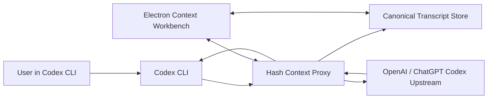

# Hash Context for Codex CLI PRD

## 1. 文档目的

本 PRD 用来确定 Hash Context 接入 Codex CLI 的最终产品方案。

目标不是做一个独立聊天工具，而是让用户在继续使用原生 Codex CLI 的同时，获得 HashCode 已有的上下文地图、上下文工作台和上下文编辑能力。

一句话方案：

> Codex 请求先经过本地 Hash Context 代理。未编辑时透明转发，行为等同原生 Codex；用户打开小窗编辑上下文后，代理从下一轮开始用 edited transcript 重新编译模型请求。

## 2. 背景

当前大量开发者已经习惯使用 Codex CLI 或 Claude Code 作为日常编码入口。HashCode 已经具备较好的上下文地图和上下文编辑能力，但如果要求用户换到另一个完整 IDE 或 Web App，迁移成本较高。

因此，本项目希望把 HashCode 的上下文能力变成一个可以挂到 Codex CLI 上的本地工具：

- 用户仍然在终端里使用 Codex。
- 用户需要整理上下文时，通过命令唤起一个小窗。
- 小窗展示当前 Codex 会话的上下文地图和工作台。
- 用户可以删除、压缩、替换、恢复部分上下文。
- 未发生编辑时，Codex 的行为应该和原生一致。
- 发生编辑后，之后的 Codex 请求应该使用 Hash Context 管理后的上下文。

## 3. 用户与场景

### 3.1 目标用户

- 使用 Codex CLI 做日常开发的工程师。
- 使用 ChatGPT 订阅账号登录 Codex 的用户。
- 使用 OpenAI API key 登录 Codex 的用户。
- 在长会话、复杂任务、多工具调用后，需要手动管理上下文的重度用户。

### 3.2 核心痛点

1. Codex 会话变长后，上下文里会混入大量搜索结果、工具输出、失败尝试和过时信息。
2. 用户无法直观看到当前模型到底带着哪些历史继续工作。
3. 原生 auto compact 是黑盒，触发较晚，且用户很难在 compact 前精细控制保留内容。
4. 直接修改 Codex session/rollout 文件不可控，运行中的 Codex 也不会可靠同步 UI。
5. 修改 Codex 源码不适合作为 GitHub 工具分发方案。

## 4. 产品目标

### 4.1 P0 目标

- 不修改 `D:\opensource\codex` 或用户安装的 Codex 源码。
- 通过包装器启动 Codex，并临时把 Codex provider 指到本地代理。
- 支持 ChatGPT 订阅登录和 API key 登录。
- Codex 普通请求未编辑时透明转发。
- 代理保存 canonical transcript，Electron 小窗实时读取该 transcript。
- 小窗可从 Codex 输入框通过 `context` / `ctx` 唤起。
- 用户应用编辑后，下一轮 Codex 请求使用 edited transcript。
- 运行中 turn 和 compact 中状态只读。
- 接管 Codex remote compact 请求的 input 来源。

### 4.2 P1 目标

- 小窗内支持更可靠的上下文编辑操作：删除、压缩、替换、恢复。
- 支持工具调用、工具结果、reasoning、provider raw item 的可见化和保留。
- 支持工作台内部调用模型进行上下文建议或压缩，并复用 Codex 订阅登录授权。
- 提供清晰的调试日志、状态页和测试命令。

### 4.3 非目标

- 不重做 Codex CLI UI。
- 不直接编辑 Codex session/rollout 文件。
- 不在 MVP 中主动伪造 token usage 来强行诱导 auto compact。
- 不在 MVP 中支持 WebSocket Responses 链路。
- 不要求所有 provider 都可用，MVP 聚焦 OpenAI Responses API 和 Codex 当前登录体系。

## 5. 用户体验

### 5.1 启动

用户进入项目目录后运行：

```powershell
npm run codex
```

系统启动：

- 本地代理：`http://127.0.0.1:8787`
- HashCode backend：`http://127.0.0.1:8765`
- React frontend：`http://127.0.0.1:5174`
- Electron 小窗控制服务：`http://127.0.0.1:8790`
- Codex CLI

这些端口是本地模块边界，不是用户需要理解的产品概念。正式产品可以封装成一个命令或安装包。

### 5.2 正常使用 Codex

用户像原来一样在终端里输入需求。

未编辑上下文时：

- Codex 请求先打到本地代理。
- 代理记录请求和响应。
- 代理把请求透明转发给真实上游。
- Codex CLI 收到的流式输出不变。

用户感知应该是“和原生 Codex 一样”。

### 5.3 打开上下文工作台

用户在 Codex 输入框输入：

```text
context
```

或：

```text
ctx
```

Codex hook 拦截该输入：

- 打开 Electron 小窗。
- 不把这条控制命令发给模型。
- 小窗默认展示当前 active Codex session。
- 没有真实 session 时才展示 demo 数据。

### 5.4 查看和编辑上下文

小窗展示类似 HashCode 完全展开后的右侧工作台：

- 左侧：上下文地图。
- 右侧：建议、手动、恢复、设置等工作区。
- 顶层节点只显示用户轮次和助手轮次。
- 工具调用、工具结果、reasoning summary、provider raw items 放在 assistant record 内部。

用户可以：

- 删除无用上下文。
- 压缩长工具输出或长对话。
- 替换错误内容。
- 恢复到未编辑状态。
- 应用编辑。

应用编辑后：

- session 进入 `override`。
- 下一轮 Codex 请求由代理使用 edited transcript 编译 Responses `input`。
- 代理移除 `previous_response_id`，避免服务端链式上下文绕开本地编辑。

### 5.5 运行中只读

当 Codex 正在生成、运行命令或 compact 时：

- 最新 assistant 节点显示正在运行。
- 工作台只读。
- 禁止删除、压缩、替换、恢复、应用编辑。
- SSE 完成后，代理把临时 assistant 聚合为完整 assistant transcript record，再恢复编辑能力。

### 5.6 Compact 体验

Codex 自己判断需要 auto compact 时，会请求：

```text
POST /v1/responses/compact
```

代理行为：

- 不使用 Codex compact 请求中的旧 `input`。
- 改用 Hash Context 当前 canonical transcript。
- 如果有编辑，则使用 edited transcript。
- 运行中的临时 assistant 不参与 compact。
- 保留 Codex compact 请求里的 `model`、`instructions`、`tools`、`parallel_tool_calls`、`reasoning`、`text`。
- 转发到真实上游 `/responses/compact`。
- 原样返回 `{ output }` 给 Codex。
- 同时把 `{ output }` 反向转换为 Hash Context transcript。

这样 Codex 仍然通过自己的 `replace_compacted_history` 更新本地 history、token usage、session 文件和 UI 状态。

## 6. 技术方案

### 6.1 接入方式

不修改 Codex 源码，通过 Codex 支持的 `-c` 临时配置覆盖 provider：

```powershell
codex `
  -c "model_providers.hash-context.name=OpenAI" `
  -c "model_providers.hash-context.base_url=http://localhost:8787/v1" `
  -c "model_providers.hash-context.requires_openai_auth=true" `
  -c "model_providers.hash-context.wire_api=responses" `
  -c "model_providers.hash-context.supports_websockets=false" `
  -c "model_provider=hash-context"
```

关键点：

- provider id 是 `hash-context`，用于区分本地代理。
- provider name 是 `OpenAI`，用于触发 Codex remote compaction 逻辑。
- `requires_openai_auth=true`，让 Codex 继续复用自身登录体系。
- `supports_websockets=false`，避免 `previous_response_id` 和 WebSocket 链式上下文影响本地改写。

### 6.2 本地服务

| 模块 | 默认端口 | 职责 |
|---|---:|---|
| proxy_server.py | 8787 | Codex-compatible Responses proxy |
| web_server.py | 8765 | HashCode backend / context workbench API |
| Vite frontend | 5174 | React UI |
| Electron control server | 8790 | show/hide context window |

正式发布时可以把这些封装成一个后台 supervisor。端口仍然存在，但对用户隐藏。

### 6.3 请求链路



### 6.4 认证链路

代理根据请求头选择上游：

- API key / bearer：`https://api.openai.com/v1`
- ChatGPT 订阅登录：`https://chatgpt.com/backend-api/codex`

工作台内部如果需要调用模型，会发带内部标记的请求：

- `x-hash-context-internal: context-workbench`
- 或 `metadata.hash_context_internal = context-workbench`

代理会复用之前从 Codex 正常请求中捕获到的 ChatGPT 授权头。若尚未捕获授权，则提示用户先通过代理发送一条普通 Codex 消息。

### 6.5 数据模型

Hash Context 的 source of truth 是 canonical transcript，不是 Responses wire format。

顶层 transcript 只允许：

- `user`
- `assistant`

assistant record 内部保存：

- `blocks`
- `toolEvents`
- `providerItems`
- reasoning summary
- function call / function call output
- tool search / tool search output
- shell call / custom tool call
- raw provider items

原则：

- UI 编辑 transcript。
- 代理发请求时把 transcript 编译成 Responses `input`。
- 代理收响应时把 Responses items 反向转换成 transcript。
- `providerItems` 用于保留 wire format，避免丢失 `call_id`、工具调用结构和 compaction item。

### 6.6 Session 状态

| 状态 | 含义 | UI |
|---|---|---|
| mirror | 未编辑，代理透明镜像 Codex 请求 | 可编辑 |
| running | 当前 turn 正在生成 | 只读 |
| compacting | Codex 正在 compact | 只读 |
| override | 用户已应用编辑，之后请求使用 edited transcript | 可编辑 |
| error | 请求失败，保留 partial transcript 和错误 | 可查看，谨慎编辑 |

## 7. 功能需求

### 7.1 启动包装器

P0：

- `npm run codex` 一键启动本地服务和 Codex。
- 自动检测并清理旧的本地服务进程。
- 输出代理地址、日志地址和打开工作台的方法。
- 支持向 Codex 透传额外参数。

验收：

- 用户运行 `npm run codex` 后可正常进入 Codex。
- 普通消息可正常返回。
- 输入 `context` / `ctx` 可打开小窗。

### 7.2 普通 Responses 代理

P0：

- 支持 `POST /v1/responses`。
- 支持 SSE 流式转发。
- 支持 `Content-Encoding: zstd/gzip/br` 请求体解码。
- 未编辑时透明转发。
- 编辑后用 edited transcript 重新编译 `input`。
- 移除 `previous_response_id`。

验收：

- 未编辑时 Codex 行为等同原生。
- 编辑后下一轮请求不包含被删除/替换的上下文。
- SSE 输出可正常回到 Codex。

### 7.3 上下文工作台

P0：

- Electron 小窗可隐藏启动。
- 通过 Codex hook 唤起。
- 展示 active session。
- 展示 user/assistant 顶层上下文地图。
- 支持只读状态。
- 支持应用编辑和 reset。

P1：

- 支持 markdown 渲染。
- 支持长消息懒渲染，避免展开前卡顿。
- 支持工具调用摘要和原始结构查看。
- 支持内部模型建议。

### 7.4 Compact 接管

P0：

- 支持 `POST /v1/responses/compact`。
- 替换 compact body 的 `input`。
- 保留 compact body 的其他合法字段。
- 成功后把 compact output 作为新的 canonical baseline。
- 失败时不修改 transcript，只记录错误。

验收：

- 伪造 Codex compact 请求时，上游收到的是 Hash Context transcript。
- 上游返回 `{ output }` 后，代理 session 显示 compact 后 transcript。
- `type: compaction` 保留为 provider raw item，但不把 encrypted content 当作可见文本。

### 7.5 Models 与内部请求

P1：

- 支持 `GET /v1/models`。
- 支持 ChatGPT models payload 归一化为 OpenAI-compatible list。
- 支持工作台内部模型请求复用 Codex ChatGPT 授权。
- 内部请求不写入 Codex session transcript。

验收：

- 工作台内部请求可复用订阅登录。
- 未捕获订阅登录时返回明确错误。
- 内部请求不会污染上下文地图。

## 8. 测试计划

### 8.1 自动化测试

已有测试命令：

```powershell
npm run test:compact-proxy
```

覆盖：

- tool turn 仍聚合成一个 assistant record。
- Codex 多种 ResponseItem 类型可 roundtrip。
- models 请求可复用 cached ChatGPT auth。
- 内部 context request 不进入 session。
- 缺少 cached auth 时返回明确错误。
- 伪造 `/v1/responses/compact` 可验证 compact input 替换和 output 回写。

### 8.2 构建验证

```powershell
python -m py_compile proxy_server.py web_server.py scripts\test_compact_proxy.py
npm run typecheck
npm run build
```

### 8.3 人工验证

- `npm run codex` 启动成功。
- 普通 Codex 对话成功。
- 输入 `context` 打开小窗。
- Codex 运行中，小窗只读。
- 应用编辑后，下一轮请求使用 edited transcript。
- reset 后恢复 mirror。
- 长工具输出不会导致左侧上下文地图明显卡顿。

## 9. 成功指标

MVP 成功标准：

- 用户不改 Codex 配置文件也能通过包装器使用。
- 普通 Codex 对话成功率接近原生。
- 用户能在小窗看到当前 Codex session。
- 编辑后下一轮上下文确实生效。
- compact 代理测试稳定通过。
- 运行中不会允许危险编辑。

后续产品指标：

- 用户主动打开上下文工作台的频率。
- 应用编辑后的继续对话成功率。
- 长会话中手动上下文清理节省的 token 数。
- compact 前后模型回答质量变化。
- 因代理导致的请求失败率。

## 10. 风险与开放问题

### 10.1 Codex 内部协议变化

Codex 的 Responses body、compact output 或认证头可能变化。

缓解：

- 保留 provider raw items。
- 增加 wire format roundtrip 测试。
- 避免依赖 Codex session 文件格式。

### 10.2 Transcript 与 wire format 转换风险

工具调用和工具结果必须保持 `call_id` 对应关系。

缓解：

- transcript 只作为产品语义层。
- provider wire item 原样保留在 `providerItems`。
- 编辑文本时尽量只替换 message content，不重建结构化 item。

### 10.3 ChatGPT 订阅登录复用

工作台内部请求需要复用 Codex 捕获到的授权头。

风险：

- 用户还没通过代理发过普通 Codex 请求。
- ChatGPT 上游增加 Cloudflare 或新的 header 要求。

缓解：

- 提示用户先发送一条普通 Codex 消息。
- 记录 upstream headers 的安全脱敏日志。

### 10.4 Auto compact 真实触发慢

真实上下文达到阈值耗时长。

缓解：

- 使用伪造 compact 测试覆盖核心代理逻辑。
- 后续可增加低阈值测试 profile 或 mock Codex app-server 测试。

### 10.5 多端口与发布体验

当前调试工程有多个本地服务端口。

缓解：

- MVP 保持清晰模块边界。
- 发布版使用一个 launcher/supervisor 统一管理。
- 用户只暴露一个启动命令和一个小窗入口。

## 11. 里程碑

### M0: Lab 可运行

- Electron 小窗可打开。
- Codex 包装器可启动。
- 普通 `/v1/responses` 代理可用。
- 小窗能看到 proxy session。

### M1: Context Override MVP

- canonical transcript 存储。
- mirror / running / override / error 状态。
- 应用编辑后下一轮请求生效。
- 运行中只读。

### M2: Compact 接管

- provider name `OpenAI` 启用 remote compact。
- `/v1/responses/compact` 接管 input。
- compact output 回写 transcript。
- compacting 只读。
- 伪造 compact 测试通过。

### M3: Workbench 内部智能能力

- 工作台内部模型请求。
- 复用 Codex 订阅登录。
- 内部请求不污染 Codex session。
- 上下文建议、压缩、替换流程产品化。

### M4: 可发布工具

- 打包为 GitHub 可安装工具。
- 提供 README、故障排查、日志说明。
- 支持 Windows 优先，后续支持 macOS/Linux。
- 增加版本兼容矩阵。

## 12. 推荐最终方案

推荐采用当前方向作为最终方案：

1. 不改 Codex 源码。
2. 使用包装器和 `-c` provider override 接入。
3. 本地代理作为上下文 source of truth 的执行层。
4. Electron 小窗作为上下文工作台入口。
5. Codex 原始 UI 和 session 文件仍由 Codex 自己维护。
6. Hash Context 只在请求边界改写上下文，并在 compact 边界同步结果。

这个方案的优势是：

- 分发成本低。
- 对 Codex 侵入小。
- 能同时支持 API key 和 ChatGPT 订阅登录。
- 可以渐进增强，不需要一次性重做 CLI。
- 即使用户不打开工作台，Codex 体验也应接近原生。

最大的技术重点是继续强化 transcript 和 Responses wire format 的双向转换测试。
