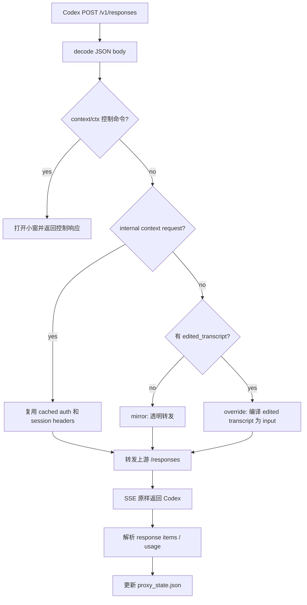

# Codex Context Proxy 技术实现文档

| 项目 | 内容 |
|---|---|
| 文档版本 | v1.2 |
| 最后更新 | 2026-05-22 |
| 关联文档 | [产品 PRD](./核心功能PRD.md)、[历史方案入口](./hash-context-codex-prd.md) |

> 本文档说明当前项目的核心实现。产品层面的“做什么”和优先级请看 PRD。

---

## 0 当前 Codex 源码对照

本次更新除了读取当前项目代码，也对照了本机当前 Codex 源码 `D:\opensource\codex` 的关键协议点：

| Codex 源码位置 | 当前结论 | 对本文档的影响 |
|---|---|---|
| `codex-api/src/common.rs` | `ResponsesApiRequest` 包含 `model`、`instructions`、`input`、`tools`、`tool_choice`、`parallel_tool_calls`、`reasoning`、`store`、`stream`、`include`、`service_tier`、`prompt_cache_key`、`text`、`client_metadata` | 代理改写时必须尽量保留这些字段 |
| `codex-api/src/common.rs` | 当前 HTTP Responses request 没有 `previous_response_id`；WebSocket create request 仍有该字段 | 文档不能再写成 HTTP 路径天然依赖 `previous_response_id`；项目删除该字段是兼容性防御 |
| `codex-api/src/endpoint/responses.rs` | HTTP Responses 路径是 `POST /responses`，SSE 使用 `Accept: text/event-stream`，并携带 `session-id`、`thread-id` 等 header | 本项目通过 `base_url=http://localhost:8787/v1` 接住 `/v1/responses` |
| `codex-api/src/endpoint/compact.rs` | compact 路径是 `POST /responses/compact`，响应形态为 `{ output: ResponseItem[] }` | `proxy_server.py` 的 `/v1/responses/compact` 与当前 Codex 协议一致 |
| `core/src/compact.rs`、`model-provider-info/src/lib.rs` | remote compact 由 `provider.supports_remote_compaction()` 决定，当前 OpenAI/Azure 为 true | 当前默认 `Hash Context` provider 不应被文档描述成一定会触发 remote compact |
| `config/src/hook_config.rs` | hook command 配置字段接受 `timeout`，并映射为内部 `timeout_sec` | 当前脚本使用 `timeout=10` 是符合当前配置解析的 |

---

## 1 技术架构概览

```
┌────────────────────────────────────────────────────────────┐
│                    Codex CLI / Desktop                      │
└───────────────────────────┬────────────────────────────────┘
                            │ Responses API
                            ▼
┌────────────────────────────────────────────────────────────┐
│ proxy_server.py                                             │
│ - /v1/responses                                             │
│ - /v1/responses/compact                                     │
│ - /v1/models                                                │
│ - /api/proxy/* session / override / usage                   │
└───────────────┬────────────────────────────┬───────────────┘
                │                            │
                ▼                            ▼
┌──────────────────────────────┐  ┌──────────────────────────┐
│ OpenAI / ChatGPT Codex 上游   │  │ data/proxy_state.json     │
└──────────────────────────────┘  └──────────────────────────┘

┌────────────────────────────────────────────────────────────┐
│ electron/context-window.cjs                                 │
│ - 启动 proxy、backend、frontend                              │
│ - 提供 8790 show/hide 控制服务                               │
└───────────────────────────┬────────────────────────────────┘
                            ▼
┌────────────────────────────────────────────────────────────┐
│ web_server.py + React/Vite                                  │
│ - 上下文地图 / 工作台 API                                   │
│ - context workbench draft / tools / revision                 │
│ - 与 proxy session 同步 override                             │
└────────────────────────────────────────────────────────────┘
```

主要运行模块：

| 模块 | 默认端口 | 职责 |
|---|---:|---|
| `proxy_server.py` | 8787 | Codex-compatible Responses 代理 |
| `web_server.py` | 8765 | HashCode 工作台后端和静态资源服务 |
| Vite dev server | 5174 | 开发态 React 前端 |
| `electron/context-window.cjs` | 8790 | Electron 小窗和控制服务 |

---

## 2 启动链路

### 2.1 开发态一键启动

`npm run codex` 执行 `scripts/codex-with-context.ps1`：

1. 查找真实 Codex 命令。
2. 清理当前项目占用的旧服务端口。
3. 隐藏启动 Electron 小窗。
4. 等待 proxy、backend、frontend、window-control 就绪。
5. 用 Codex `-c` 临时配置注入本地 provider。
6. 注入 `UserPromptSubmit` hook，用于拦截 `context` / `ctx`。

关键 provider 配置：

```powershell
-c "model_providers.hash-context.name=Hash Context"
-c "model_providers.hash-context.base_url=http://localhost:8787/v1"
-c "model_providers.hash-context.requires_openai_auth=true"
-c "model_providers.hash-context.wire_api=responses"
-c "model_providers.hash-context.supports_websockets=false"
-c "model_provider=hash-context"
```

`supports_websockets=false` 的作用是让 Codex 走 HTTP Responses + SSE 路径，保证代理能稳定观察和改写请求。当前 Codex 的 HTTP Responses 请求结构本身没有 `previous_response_id`；代理仍会在编辑重写、部分 compact 替换场景里防御性删除该字段，兼容旧请求或其它路径。

### 2.2 CLI shim

`scripts/codex-ctx-proxy.ps1` 负责安装一个托管的 `codex.cmd` / `codex.ps1`：

- 状态文件：`%USERPROFILE%\.hash-context-codex\codex-ctx-proxy.json`
- 默认 shim 目录：`%USERPROFILE%\.hash-context-codex\bin`
- 开启后，`codex` 会先走 Hash Context，再调用真实 Codex。
- 关闭后，`codex` 直接透传给真实 Codex。

用户命令：

```powershell
codex ctx proxy on
codex ctx proxy off
codex ctx proxy status
codex ctx proxy uninstall
```

### 2.3 Desktop 接入

`scripts/codex-desktop-proxy.ps1` 修改 `.codex/config.toml`，写入托管配置块：

- 顶层块：`model_provider = "hash-context"` 和 hooks 配置。
- provider 块：`[model_providers.hash-context]`。
- 每次写入前备份到 `%USERPROFILE%\.hash-context-codex\backups`。
- `off` 会移除托管块并停止本项目服务。
- `repair` 用来清理已知格式异常的 `projects.*` TOML table。

Desktop 方式是实验支持，因为它改的是用户 Codex 配置文件，而 CLI shim 只是命令包装。

---

## 3 代理服务实现

### 3.1 ProxySession

`proxy_server.py` 中的 `ProxySession` 是代理侧核心状态：

```python
@dataclass
class ProxySession:
    id: str
    title: str
    status: str = "mirror"
    transcript: list[dict[str, Any]] = field(default_factory=list)
    override_base_transcript: list[dict[str, Any]] | None = None
    edited_transcript: list[dict[str, Any]] | None = None
    pending_transcript: list[dict[str, Any]] | None = None
    local_compact_source_transcript: list[dict[str, Any]] | None = None
    request_log: list[dict[str, Any]] = field(default_factory=list)
    response_items: list[dict[str, Any]] = field(default_factory=list)
    usage_events: list[dict[str, Any]] = field(default_factory=list)
    last_codex_session_headers: dict[str, str] = field(default_factory=dict)
    last_turn_metadata_header: str = ""
    last_error: str = ""
```

关键字段解释：

| 字段 | 说明 |
|---|---|
| `transcript` | 代理从 Codex 原始请求/响应捕获出的上下文 |
| `edited_transcript` | 工作台应用编辑后的上下文 |
| `override_base_transcript` | 编辑发生时的基线，用于和下一轮 Codex body 做合并 |
| `pending_transcript` | 当前 turn 运行中的临时上下文，用于 UI 只读展示 |
| `local_compact_source_transcript` | local compact 时需要被摘要化的来源上下文 |
| `last_codex_session_headers` | 内部 workbench 请求复用 Codex session 头 |
| `usage_events` | main / context_workbench / compact 的 usage 记录 |

### 3.2 ProxyStore

`ProxyStore` 管理所有 session，持久化到 `data/proxy_state.json`。主要职责：

| 方法 | 作用 |
|---|---|
| `begin_request()` | 普通 `/v1/responses` 前处理，决定透明转发还是 override rewrite |
| `complete_response()` | SSE 完成后把 response items 反向写回 transcript |
| `begin_compact()` | remote compact 前处理，必要时替换 compact input |
| `complete_compact()` | compact 成功后把 output 写回 transcript |
| `record_control_intercept()` | 记录 `context` / `ctx` 控制命令拦截 |
| `override()` | 保存工作台提交的 edited transcript |
| `reset()` | 清除 override，回到 mirror |
| `record_usage()` | 记录 Responses usage |

### 3.3 普通请求链路

`POST /v1/responses` 的核心流程：

1. 解码请求体，支持 zstd/gzip/br。
2. 判断是否是内部 context workbench 请求。
3. 非内部请求先检测 `context` / `ctx` 控制命令。
4. 未编辑 session：保存 source transcript，透明转发原 body。
5. 已编辑 session：合并 edited transcript、override base 和当前 Codex body。
6. 如果发生 override rewrite 或 compact prompt 替换，则在需要时移除 `previous_response_id`。
7. 转发到上游 `/responses`。
8. 原样把 SSE chunk 写回 Codex。
9. 解析 SSE，收集 response items、文本和 usage。
10. 完成后写回 `ProxySession`。

流程图：



### 3.4 Compact 链路

`POST /v1/responses/compact` 的核心逻辑：

- 如果 session 没有本地编辑，基本保留 Codex compact body。
- 如果存在 `edited_transcript`，代理用本地编辑后的上下文替换 body 的 `input`。
- 保留 `model`、`instructions`、`tools`、`parallel_tool_calls`、`reasoning`、`service_tier`、`prompt_cache_key`、`text` 等字段。
- 成功后读取上游 JSON 的 `output`，转成 transcript。
- 有 override 的 session compact 后仍保持 `override` 状态；没有 override 则回到 `mirror`。

### 3.5 Local Compact

当前代码还处理 Codex 发起的“本地 compact prompt”场景。代理会识别 compact prompt，把它替换为更适合当前 Hash Context transcript 的 prompt。模型返回摘要后，代理用 `local_compacted_transcript()` 生成可读摘要记录，并清理重复 compact summary。

这部分不是用户直接操作的功能，但会影响长上下文时的自动压缩体验。

当前 Codex 源码里，manual compact 和 auto compact 会先判断 provider 是否支持 remote compaction。OpenAI/Azure provider 走 `/responses/compact`；非 remote provider 走普通 Responses 请求并注入 compact prompt。当前项目默认注入的 provider 显示名是 `Hash Context`，所以实际运行更需要保证 local compact prompt 接管可靠；`/v1/responses/compact` 仍作为已实现的兼容入口保留，并由测试覆盖。

### 3.6 认证与上游选择

上游选择规则：

| 登录方式 | 上游 |
|---|---|
| OpenAI API key / bearer | `https://api.openai.com/v1` |
| ChatGPT 订阅登录 | `https://chatgpt.com/backend-api/codex` |

内部 workbench 模型请求会带：

- `x-hash-context-internal: context-workbench`
- 或 `metadata.hash_context_internal = context-workbench`

代理不会把内部请求写入 Codex session transcript。若没有捕获到 Codex 授权，返回 `codex_auth_not_captured`。

---

## 4 Web 后端与工作台

### 4.1 SessionState

`web_server.py` 中的 `SessionState` 是工作台后端的会话状态：

```python
@dataclass(slots=True)
class SessionState:
    session_id: str
    title: str
    scope: str
    project_id: str | None
    agent: SimpleAgent | None
    transcript: list[dict[str, object]]
    context_workbench_history: list[dict[str, str]]
    context_revisions: list[dict[str, object]]
    pending_context_restore: dict[str, object] | None
    active_request_mode: str | None = None
    active_request_id: str | None = None
    active_cancel_event: threading.Event | None = None
    agent_hydrated: bool = True
```

注意：当前项目的 `web_server.py` 已经吸收了 HashCode 的一部分能力，但没有拆成 `web_server_modules/`。所以技术定位上它是“后端总调度 + context workbench 核心实现”的单文件服务。

### 4.2 AppState

`AppState` 管理：

- 项目列表和普通 chat sessions。
- 每个 session 的 transcript、工作台历史、revision。
- 主聊天和上下文工作台的互斥请求锁。
- JSON 持久化。
- 从 proxy active context 刷新 session。
- 工作台编辑完成后同步 proxy override。

当前前端小窗的主路径是 proxy session：`WorkbenchWindow.tsx` 读取 `/api/proxy/sessions`，找到 active session 后调用 `/api/proxy-sync-session` 把代理 transcript 同步进 `web_server.py`。

### 4.3 ContextWorkbenchDraft

`ContextWorkbenchDraft` 是一轮上下文模型对话里的工作快照：

- 从当前 transcript 构建节点。
- internal prefix 节点标记为 locked，不参与编辑编号。
- 记录 selected node numbers。
- mutation 工具只修改 draft 节点和 item。
- 本轮结束后统一 commit。

关键原则：

> 左侧上下文地图显示的是正式 transcript；右侧模型操作的是本轮 draft；只有模型回合结束且有修改时，才写回正式 transcript 和 revision。

### 4.4 工具体系

`ContextWorkbenchToolRegistry` 当前注册 10 个工具：

| 工具 | 作用 |
|---|---|
| `get_context_node_details` | 展开一个或多个节点的完整可编辑内容 |
| `find_context_items` | 按节点、item、类型、角色、文本或工具过滤 item |
| `edit_context_items` | 批量删除、替换或压缩 item |
| `compress_context_nodes` | 把多个节点替换为一个摘要节点 |
| `delete_context_nodes` | 删除一个或多个节点 |
| `delete_context_item` | 删除单节点内一个或多个 item |
| `replace_context_item` | 替换单节点内一个 item |
| `compress_context_item` | 压缩单节点内一个 item |
| `confirm_working_snapshot` | 确认最终 active 节点概览 |
| `set_context_revision_summary` | 写入恢复页摘要 |

与早期文档相比，当前实现新增了 `find_context_items` 和 `edit_context_items`，用于更稳的批量定位和批量编辑。

### 4.5 目标定位边界

工具层以“显式参数优先”为原则：

- 读详情、删除、压缩等操作需要明确 `node_numbers`。
- 缺少目标时返回 `target_resolution`，由模型重新确认。
- assistant 节点需要先展开详情，再做依赖内部内容的压缩。
- 已返回详情的节点会在本轮缓存，避免重复传输。

代码中仍保留了轻量 hint/candidate 逻辑，但它只用于给模型返回候选，不应该让工具层擅自修改上下文。

### 4.6 Revision

每次工作台修改完成后生成 revision：

```json
{
  "id": "uuid",
  "revision_number": 3,
  "label": "Revision 3",
  "summary": "压缩了 Node #4 的工具输出",
  "created_at": "2026-05-22T12:00:00Z",
  "change_type": "compress",
  "change_types": ["compress"],
  "changed_nodes": [4],
  "snapshot": [],
  "context_workbench_history_snapshot": [],
  "operations": [],
  "is_active": true
}
```

恢复流程：

1. `POST /api/context-restore` 找到目标 revision。
2. 保存当前状态到 `pending_context_restore`。
3. 切换 transcript 和手动页历史。
4. 标记目标 revision 为 active。
5. 若该 session 是 proxy session，同步 override 到 proxy。

撤回恢复走 `POST /api/context-undo-restore`。

---

## 5 前端实现

### 5.1 入口

| 文件 | 职责 |
|---|---|
| `react_app/src/main.tsx` | React 根挂载 |
| `react_app/src/WorkbenchWindow.tsx` | Electron 小窗主入口，围绕 proxy session 工作 |
| `react_app/src/App.tsx` | HashCode 主应用入口，保留完整聊天和项目能力 |
| `react_app/src/api.ts` | API 封装 |
| `react_app/src/types.ts` | 前后端共享类型 |

### 5.2 核心组件

| 组件 | 职责 |
|---|---|
| `ContextMapSidebar.tsx` | 上下文地图、节点选择、展开、minimap |
| `ContextWorkbench.tsx` | 建议页、手动页、恢复页、设置页 |
| `MessageContent.tsx` | 文本、markdown、工具块渲染 |
| `SettingsProvidersPanel.tsx` | provider 和模型设置 |

### 5.3 Proxy 同步

小窗启动后：

1. `fetchInitRequest()` 获取 backend 状态。
2. `fetchProxySessionsRequest()` 获取 proxy active session。
3. 如果 proxy session 不在 backend 中，调用 `/api/proxy-sync-session` 创建或更新 session。
4. 工作台修改 transcript 后，调用 `/api/proxy-session-override` 写回 `proxy_server.py`。
5. reset 时调用 `/api/proxy-session-reset` 清除 override。

---

## 6 API 清单

### 6.1 Proxy API

| 方法 | 路径 | 说明 |
|---|---|---|
| GET | `/api/proxy/health` | proxy 健康检查 |
| GET | `/v1/models` | Codex-compatible models |
| POST | `/v1/responses` | Codex Responses SSE 代理 |
| POST | `/v1/responses/compact` | Codex remote compact 代理 |
| GET | `/api/proxy/sessions` | proxy session 列表 |
| GET | `/api/proxy/sessions/:id` | session 详情 |
| POST | `/api/proxy/sessions/:id/override` | 保存 edited transcript |
| POST | `/api/proxy/sessions/:id/reset` | 清除 override |
| GET | `/api/proxy/sessions/:id/usage` | 单 session 用量 |
| POST | `/api/proxy/sessions/:id/usage/reset` | 清空单 session 用量 |

### 6.2 Backend API

| 方法 | 路径 | 说明 |
|---|---|---|
| GET | `/api/health` | backend 健康检查 |
| GET | `/api/init` | 前端 bootstrap |
| GET/POST | `/api/context-workbench-settings` | 工作台模型和工具设置 |
| POST | `/api/context-workbench-suggestions` | 建议页统计 |
| POST | `/api/context-chat-stream` | 上下文模型流式对话 |
| POST | `/api/context-restore` | 恢复 revision |
| POST | `/api/context-undo-restore` | 撤回恢复 |
| POST | `/api/proxy-sync-session` | 从 proxy transcript 同步 backend session |
| POST | `/api/proxy-session-override` | backend 写 proxy override |
| POST | `/api/proxy-session-reset` | backend 清 proxy override |
| POST | `/api/proxy-session-usage-reset` | 清空 proxy usage |

---

## 7 持久化与日志

| 数据 | 默认位置 | 说明 |
|---|---|---|
| proxy state | `data/proxy_state.json` 或 Electron userData `data/proxy_state.json` | proxy sessions、override、usage |
| backend state | `data/hash_web_state.json` 或 Electron userData `data/hash_web_state.json` | backend sessions、projects、revisions |
| settings | `data/openai_settings.json` | provider 和模型配置 |
| proxy log | `data/proxy.log` | 代理请求日志 |
| electron log | Electron userData `logs/electron-window.log` | 小窗启动和服务日志 |
| hook log | `logs/codex-context-hook.log` | hook 拦截和 session sync 日志 |

Electron 打包态会把数据目录放到 app userData 下；源码开发态默认使用项目目录。

---

## 8 构建与测试

常用命令：

```powershell
npm run setup:python
npm run codex
npm run window
npm run typecheck
npm run build
npm run test:compact-proxy
npm run dist:win
```

`npm run test:compact-proxy` 目前覆盖的关键内容包括：

- Responses input 与 transcript 双向转换。
- override 后删除工具项不会被下一轮重新引入。
- remote compact input 替换和 output 回写。
- local compact prompt 替换和摘要 transcript 生成。
- 内部 context request 不污染 proxy session。
- ChatGPT auth 缺失时返回明确错误。
- context workbench 工具 schema、批量删除、批量替换、压缩等行为。
- usage 统计和 reset。

建议合并前验证：

```powershell
python -m py_compile proxy_server.py web_server.py scripts\test_compact_proxy.py
npm run typecheck
npm run build
npm run test:compact-proxy
```

---

## 9 关键设计取舍

### 9.1 不修改 Codex 源码

所有接入都发生在 provider 配置、hook 和本地代理层。这样分发简单，也降低了跟随 Codex 上游变化的维护成本。

### 9.2 不直接编辑 Codex session 文件

Codex 自己维护 history、session 文件和 UI 状态。Hash Context 只在请求边界改变下一轮模型看到的 `input`，并在 compact 边界同步结果。

### 9.3 transcript 是产品语义层

代理不把 Responses wire format 直接暴露成用户编辑对象。UI 编辑的是规范化 transcript；provider raw items 用来保留结构，避免丢失 `call_id`、工具调用和 compact item。

### 9.4 运行中只读

`running` 和 `compacting` 时不允许提交编辑。原因不是 UI 限制，而是数据一致性要求：当前 turn 的 SSE 还没聚合成稳定 assistant record。

### 9.5 Desktop 是实验路径

CLI shim 对用户配置侵入较小；Desktop 需要修改 `.codex/config.toml`，所以保留 `probe`、`status`、`repair` 和备份恢复机制。
